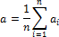

# Среднее значение

Среднее значение
-

# Среднее значение

Среднее значение - это среднее арифметическое, рассчитанное путем сложения группы чисел и деления на количество этих чисел (n).

См. также:

[Библиотека методов и моделей](../uimodelling_lib_common.htm) | [IModelling.Average](KeMs.chm::/Interface/IModelling/IModelling.Average.htm) | [IModelling.Averagei](KeMs.chm::/Interface/IModelling/IModelling.Averagei.htm)

		Справочная
		 система на версию 10.9
		 от 18/08/2025,
		 © ООО «ФОРСАЙТ»,
