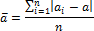

# Среднее отклонение

Среднее отклонение
-

# Среднее отклонение

Один из показателей размаха и интенсивности [вариации](UiModelling_CoeffVar.htm) - среднее линейное отклонение (средний модуль отклонения) от среднего арифметического. Среднее линейное отклонение рассчитывается по формуле:

Где:

-
a, [Среднее значение](UiModelling_Avg.htm);

-
ai. Элемент выборки;

-
n. Размер выборки.

См. также:

[Библиотека методов и моделей](../uimodelling_lib_common.htm)

		Справочная
		 система на версию 10.9
		 от 18/08/2025,
		 © ООО «ФОРСАЙТ»,
