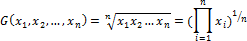

# Среднее геометрическое

Среднее геометрическое
-

# Среднее геометрическое

Среднее геометрическое значение - величина, равная корню n-й степени из произведения n данных величин. Вычисляется по формуле:

Где:

-
xi. Элемент выборки;

-
n. Размер выборки.

Среднее геометрическое всегда будет меньше [среднего арифметического](UiModelling_Avg.htm) тех же чисел. За исключением случая, когда все взятые числа равны друг другу.

См. также:

[Библиотека методов и моделей](../uimodelling_lib_common.htm)

		Справочная
		 система на версию 10.9
		 от 18/08/2025,
		 © ООО «ФОРСАЙТ»,
