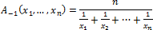

# Среднее гармоническое

Среднее гармоническое
-

# Среднее гармоническое

Среднее гармоническое чисел *x*1, *x*2, ..., *xn* - число, обратная величина которого является средним арифметическим обратных величин данных чисел. Рассчитывается по формуле:

Где:

-
xn. Элемент выборки;

-
n. Размер выборки.

Среднее гармоническое чисел не превосходит их [среднего арифметического](UiModelling_Avg.htm).

Среднее гармоническое необходимо в том случае, когда наблюдения, для которых мы хотим получить среднее арифметическое, заданы обратными значениями.

См. также:

[Библиотека методов и моделей](../uimodelling_lib_common.htm)

		Справочная
		 система на версию 10.9
		 от 18/08/2025,
		 © ООО «ФОРСАЙТ»,
