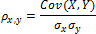
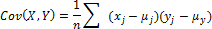
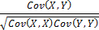
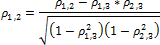
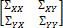
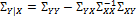

# Коэффициент корреляции

Коэффициент корреляции
-

# Коэффициент корреляции

Корреляция служит для оценки тесноты и направления линейной стохастической
 зависимости между изучаемыми переменными. Линейная вероятностная зависимость
 случайных величин заключается в том, что при возрастании одной случайной
 величины другая имеет тенденцию возрастать (или убывать) по линейному
 закону. Эта тенденция к линейной зависимости может быть более или менее
 ярко выраженной, т.е. более или менее приближаться к функциональной.

Уравнение для коэффициента корреляции имеет следующий вид:

Где:

-1 ≤ ρx,y ≤ 1

 - ковариация, то есть среднее произведений отклонений для каждой пары
 точек данных

x
 и y – выборочные средние значения.

## Парные коэффициенты корреляции

Парные коэффициенты рассчитываются по формуле:

## Частные коэффициенты корреляции

Корреляция между двумя переменными, вычисленная при фиксированных уровнях
 всех других переменных, называется частной корреляцией. Для трех переменных
 Y1,
 Y2,
 X3
 частная корреляция между переменными Y1, Y2 рассчитывается по формуле:

Где ρ - парный коэффициент
 корреляции.

В данном случае, частный коэффициент корреляции является мерой линейной
 связи между переменными Y1, Y2, исключая вклад, который по
 отдельности вносят линейные связи Y1, Y2с третьей переменной X3.

В общем случае, пусть множество переменных поделено на две группы Y и X
 с nY
 переменными во множестве Y, и
 с nX
 во множестве X.

Представим ковариационную матрицу в виде:

Ковариация Y при фиксированных
 значениях X:

Матрица частных коэффициентов корреляции:

См. также:

[Библиотека методов и моделей](../uimodelling_lib_common.htm)
 | [IStatistics.Correl](StatLib.chm::/Interface/IStatistics/IStatistics.Correl.htm)
 | [IStatistics.Covar](StatLib.chm::/Interface/IStatistics/IStatistics.Covar.htm)
 | [ISmPairCorrelation](StatLib.chm::/Interface/ISmPairCorrelation/ISmPairCorrelation.htm)
 | [ISmPartialCorrelation](StatLib.chm::/Interface/ISmPartialCorrelation/ISmPartialCorrelation.htm)

		Справочная
		 система на версию 10.9
		 от 18/08/2025,
		 © ООО «ФОРСАЙТ»,
