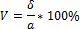

# Коэффициент вариации

Коэффициент вариации
-

# Коэффициент вариации

Коэффициент вариации характеризует относительную меру отклонения измеренных значений от [среднего арифметического](UiModelling_Avg.htm):

Где:

-
δ. [Среднеквадратическое отклонение](UiModelling_ArgSqDev.htm);

-
a. [Среднее значение](UiModelling_Avg.htm).

Чем больше значение коэффициента вариации, тем относительно больший разброс и меньшая выравненность исследуемых значений. Если коэффициент вариации меньше 10%, то изменчивость вариационного ряда принято считать незначительной, от 10% до 20% относится к средней, больше 20% и меньше 33% к значительной и если коэффициент вариации превышает 33%, то это говорит о неоднородности информации и необходимости исключения самых больших и самых маленьких значений.

См. также:

[Библиотека методов и моделей](../uimodelling_lib_common.htm)

		Справочная
		 система на версию 10.9
		 от 18/08/2025,
		 © ООО «ФОРСАЙТ»,
