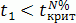

# Тест Дики-Фуллера

Тест Дики-Фуллера
-

# Тест Дики-Фуллера

Тест Дики-Фуллера является средством проверки стационарности временного ряда.

Нулевая гипотеза H0: g = 0 (существует единичный корень, ряд нестационарный).

Альтернативная гипотеза: H1: g < 0 (единичного корня нет, ряд стационарный).

Отвергаем H0 на N процентном (N=1%, 5%, 10%) уровне значимости, если 

См. также:

[Библиотека методов и моделей](../uimodelling_lib_common.htm) | [IMsDFTestSettings](KeMs.chm::/Interface/IMsDFTestSettings/IMsDFTestSettings.htm)

		Справочная
		 система на версию 10.9
		 от 18/08/2025,
		 © ООО «ФОРСАЙТ»,
