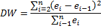

# Тест Дарбина-Уотсона

Тест Дарбина-Уотсона
-

# Тест Дарбина-Уотсона

Тест Дарбина-Уотсона используется
 для проверки гипотезы об отсутствии автокорреляции первого порядка в векторе
 остатков регрессионной модели.

Пусть (e1,…,en)
 - это вектор остатков линейной регрессии по k
 независимым переменным (включая константу). Предполагая, что остатки образуют
 авторегрессионный процесс первого порядка, можно описать их связь рекуррентным
 соотношением et = ρet-1
 + υt,
 где υt –
 последовательность независимых случайных величин с нормальным распределением.

Тест основан на проверке гипотезы об отсутствии автокорреляции H0:
 ρ = 0, критерием служит статистика
 Дарбина-Уотсона, которая рассчитывается по следующей формуле:

Можно доказать, что DW ≈ 2*(1- r),
 где r - коэффициент корреляции
 между ei
 и ei-1.
 Таким образом, значения DW находятся
 в промежутке от 0 до 4. В случае отсутствия автокорреляции DW близка
 к 2. Близость к 0 говорит о положительной автокорреляции, к 4 - об отрицательной.

На практике проверка гипотезы H0
 об отсутствии автокорреляции остатков осуществляется с помощью сравнения
 статистики DW с теоретическими
 значениями dl
 и du
 для заданного числа наблюдений n,
 числа независимых переменных модели k
 и уровня значимости α:

	- 0 < DW < dl
	 - гипотеза H0 отвергается, есть положительная
	 автокорреляция;

	- dl
	 < DW <
	 du -
	 зона неопределённости;

	- du
	 < DW <
	 4 - du - гипотеза H0
	 не отвергается, автокорреляции нет;

	- 4 - du < DW
	 < 4 - dl -
	 зона неопределённости;

	- 4 - dl < DW
	 < 4 - гипотеза H0
	 отвергается, есть отрицательная автокорреляция.

Численные методы позволяют вычислить уровень значимости, при котором
 значение DW будет совпадать со
 значениями dl
 и du.
 Полученные таким способом pl
 и pu
 можно интерпретировать следующим образом:

	- pl
	 ≤ α – гипотеза H0
	 отвергается, есть автокорреляция (положительная, если DW
	 < 2, отрицательная, если DW
	 > 2);

	- pl
	 > α, pu
	 ≤ α – зона неопределённости;

	- pu
	 > α – гипотеза H0
	 не отвергается, автокорреляции нет.

См. также:

[Библиотека методов и моделей](../uimodelling_lib_common.htm)
 | [ISummaryStatistics.DW](StatLib.chm::/Interface/ISummaryStatistics/ISummaryStatistics.DW.htm) |
 [ISummaryStatistics.DWLowerBound](StatLib.chm::/Interface/ISummaryStatistics/ISummaryStatistics.DWLowerBound.htm) |
 [ISummaryStatistics.DWUpperBound](StatLib.chm::/Interface/ISummaryStatistics/ISummaryStatistics.DWUpperBound.htm) |
 [IStatistics.DurbinWatsonProbabilities](StatLib.chm::/Interface/IStatistics/IStatistics.DurbinWatsonProbabilities.htm) |
 [IStatistics.DurbinWatsonStats](StatLib.chm::/Interface/IStatistics/IStatistics.DurbinWatsonStats.htm)

		Справочная
		 система на версию 10.9
		 от 18/08/2025,
		 © ООО «ФОРСАЙТ»,
