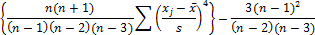

# Показатель эксцесса

Показатель эксцесса
-

# Показатель эксцесса

Эксцесс характеризует относительную остроконечность или сглаженность распределения по сравнению с нормальным распределением. Показатель эксцесса (E) рассчитывается по формуле:

,

где:

-
s. [Стандартное отклонение](UiModelling_Stddev.htm) по выборке;

-
n. Размер выборки;

-
xj. j-тый элемент выборки;

-
. [Среднее значение](UiModelling_Avg.htm).

Если Е < 0 то данные более равномерно распределены по всей области значений, если Е > 0, то данные сконцентрированы около среднеарифметического значения.

См. также:

[Библиотека методов и моделей](../uimodelling_lib_common.htm)

		Справочная
		 система на версию 10.9
		 от 18/08/2025,
		 © ООО «ФОРСАЙТ»,
