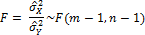

# Критерий Фишера

Критерий Фишера
-

**

# Критерий Фишера

Критерий Фишера** (F-критерий, φ*-критерий, критерий наименьшей
 значимой разности) - является параметрическим критерием и используется
 для сравнения дисперсий двух вариационных рядов.

Рассмотрим две выборки объемом m
 и n соответственно случайных
 величин X и Y,
 имеющих нормальное распределение. Необходимо проверить равенство их дисперсий.
 Статистика теста:

Где  - выборочная дисперсия.

Если статистика больше критического, то дисперсии не одинаковы. В противном
 случае дисперсии выборок одинаковы.

Таблицы критических значений F-критерия для уровня значимости 0.05:

		 f2\f1
		 1
		 2
		 3
		 4
		 5
		 6

		 1
		 161.45
		 199.50
		 215.71
		 224.58
		 230.16
		 233.99

		 2
		 18.51
		 19.00
		 19.16
		 19.25
		 19.30
		 19.33

		 3
		 10.13
		 9.55
		 9.28
		 9.12
		 9.01
		 8.94

		 4
		 7.71
		 6.94
		 6.59
		 6.39
		 6.26
		 6.16

		 5
		 6.61
		 5.79
		 5.41
		 5.19
		 5.05
		 4.95

		 6
		 5.99
		 5.14
		 4.76
		 4.53
		 4.39
		 4.28

		 7
		 5.59
		 4.74
		 4.35
		 4.12
		 3.97
		 3.87

		 8
		 5.32
		 4.46
		 4.07
		 3.84
		 3.69
		 3.58

		 9
		 5.12
		 4.26
		 3.86
		 3.63
		 3.48
		 3.37

		 10
		 4.96
		 4.10
		 3.71
		 3.48
		 3.33
		 3.22

		 11
		 4.84
		 3.98
		 3.59
		 3.36
		 3.20
		 3.09

		 12
		 4.75
		 3.89
		 3.49
		 3.26
		 3.11
		 3.00

		 13
		 4.67
		 3.81
		 3.41
		 3.18
		 3.03
		 2.92

		 14
		 4.60
		 3.74
		 3.34
		 3.11
		 2.96
		 2.85

		 15
		 4.54
		 3.68
		 3.29
		 3.06
		 2.90
		 2.79

		 16
		 4.49
		 3.63
		 3.24
		 3.01
		 2.85
		 2.74

		 17
		 4.45
		 3.59
		 3.20
		 2.96
		 2.81
		 2.70

		 18
		 4.41
		 3.55
		 3.16
		 2.93
		 2.77
		 2.66

		 19
		 4.38
		 3.52
		 3.13
		 2.90
		 2.74
		 2.63

		 20
		 4.35
		 3.49
		 3.10
		 2.87
		 2.71
		 2.60

		 f2\f1
		 7
		 8
		 9
		 10
		 15

		 1
		 236.77
		 238.88
		 240.54
		 241.88
		 245.95

		 2
		 19.35
		 19.37
		 19.38
		 19.40
		 19.43

		 3
		 8.89
		 8.85
		 8.81
		 8.79
		 8.70

		 4
		 6.09
		 6.04
		 6.00
		 5.96
		 5.86

		 5
		 4.88
		 4.82
		 4.77
		 4.74
		 4.62

		 6
		 4.21
		 4.15
		 4.10
		 4.06
		 3.94

		 7
		 3.79
		 3.73
		 3.68
		 3.64
		 3.51

		 8
		 3.50
		 3.44
		 3.39
		 3.35
		 3.22

		 9
		 3.29
		 3.23
		 3.18
		 3.14
		 3.01

		 10
		 3.14
		 3.07
		 3.02
		 2.98
		 2.85

		 11
		 3.01
		 2.95
		 2.90
		 2.85
		 2.72

		 12
		 2.91
		 2.85
		 2.80
		 2.75
		 2.62

		 13
		 2.83
		 2.77
		 2.71
		 2.67
		 2.53

		 14
		 2.76
		 2.70
		 2.65
		 2.60
		 2.46

		 15
		 2.71
		 2.64
		 2.59
		 2.54
		 2.40

		 16
		 2.66
		 2.59
		 2.54
		 2.49
		 2.35

		 17
		 2.61
		 2.55
		 2.49
		 2.45
		 2.31

		 18
		 2.58
		 2.51
		 2.46
		 2.41
		 2.27

		 19
		 2.54
		 2.48
		 2.42
		 2.38
		 2.23

		 20
		 2.51
		 2.45
		 2.39
		 2.35
		 2.20

См. также:

[ISmFisherTest](StatLib.chm::/Interface/ISmFisherTest/ISmFisherTest.htm)
 | [Библиотека
 методов и моделей](../uimodelling_lib_common.htm)

		Справочная
		 система на версию 10.9
		 от 18/08/2025,
		 © ООО «ФОРСАЙТ»,
