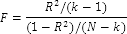
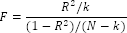

# Статистика Фишера

Статистика Фишера
-

# Статистика Фишера

Статистика Фишера используется для проверки гипотезы о связи между объясняемым
 рядом и регрессорами. Используется нулевая гипотеза: коэффициенты при
 всех регрессорах равны нулю.

Формула для расчёта статистики Фишера для модели с константой:

Формула для расчёта статистики Фишера для модели без константы:

Где:

	- R2. [Коэффициент детерминации](UiModellind_DetermCoeff_R2.htm);

	- k. Количество факторов,
	 включенных в модель (включая константу);

	- N. Количество наблюдений.

Для нецентрированного коэффициента детерминации может быть рассчитана
 соответствующая статистика Фишера.

## Вероятность статистики Фишера

Статистика Фишера имеет распределение Фишера:

	- для модели с константой: F(k - 1, N - k);

	- для модели без константы: F(k, N - k).

Нулевая гипотеза о равенстве нулю коэффициентов при всех регрессорах
 отклоняется, если вероятность меньше, чем уровень значимости. Рассматривают
 один из стандартных уровней значимости 0.1, 0.05 или 0.01.

См. также:

[ISummaryStatistics.Fstat](StatLib.chm::/Interface/ISummaryStatistics/ISummaryStatistics.Fstat.htm)
 | [ISummaryStatistics.Fstat_2](StatLib.chm::/Interface/ISummaryStatistics/ISummaryStatistics.Fstat_2.htm)
 | [ISummaryStatistics.ProbFstat](../../StatLib/Interface/ISummaryStatistics/ISummaryStatistics.ProbFstat.htm)
 | [ISummaryStatistics.ProbFstat_2](StatLib.chm::/Interface/ISummaryStatistics/ISummaryStatistics.ProbFstat_2.htm)
 | [ISmARCHTest.FStatistic](StatLib.chm::/Interface/ISmARCHTest/ISmARCHTest.FStatistic.htm)
 | [ISmBreuschPaganGodfreyTest.FStatistic](StatLib.chm::/Interface/ISmBreuschPaganGodfreyTest/ISmBreuschPaganGodfreyTest.FStatistic.htm)
 | [Библиотека
 методов и моделей](../uimodelling_lib_common.htm)

		Справочная
		 система на версию 10.9
		 от 18/08/2025,
		 © ООО «ФОРСАЙТ»,
