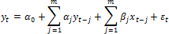
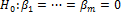
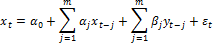

# Тест Гранжера

Тест Гранжера
-

# Тест Гранжера

Тест Гранжера предназначен для проверки причинно-следственной зависимости временных рядов.

Для расчета теста необходимо, чтобы ряды имели одинаковую длину (равное количество точек). Длина ряда также должна удовлетворять соотношению:

L ≥ 3 *m + 3

Где:

-
L. Количество точек ряда;

-
m. Лаг.

Идея теста Гранжера: если переменная x влияет на переменную y, то изменения x должны предшествовать изменениям y, но не наоборот. Таким образом, должны выполняться два условия:

-
x должен вносить вклад в прогноз y;

-
y не должен вносить значимый вклад в прогноз x.

Если обе переменных дают значимый вклад в прогноз друг друга, то вероятно, существует третья переменная z, влияющая на x и на y. Чтобы проверить нулевую гипотезу «x не влияет на y», следует оценить регрессию y на лагированные значения y и лагированные значения x:

Для данной модели гипотеза «x не влияет на y» формулируется аналогично проверке гипотезы на избыточные переменные:

Для тестирования гипотезы применяется Ф-тест.

Гипотеза «y не влияет на x» тестируется аналогично, нужно только поменять местами x и y в регрессионном уравнении.

Чтобы решить, «x влияет на y», нужно чтобы гипотеза «x не влияет на y» была отвергнута, а гипотеза «y не влияет на x» была принята.

Нужно отметить, что «x влияет на y» не означает наличие причинно-следственной связи между этими переменными, а означает, что предшествующие значения x объясняют последующие значения y, т.е. означает возможность наличия причинно-следственной связи. Если гипотеза «x не влияет на y» не отвергается, то это означает, что x не является причиной y.

На практике рекомендуется проделывать тест для нескольких различных значений m и выяснить, насколько сильно выбор m влияет на результаты теста.

См. также:

[Библиотека методов и моделей](../uimodelling_lib_common.htm) | [IMsGrangerTestSettings](KeMs.chm::/Interface/IMsGrangerTestSettings/IMsGrangerTestSettings.htm)

		Справочная
		 система на версию 10.9
		 от 18/08/2025,
		 © ООО «ФОРСАЙТ»,
