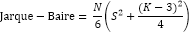
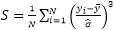
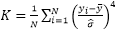
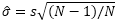

# Статистика Жака-Бера

Статистика Жака-Бера
-

# Статистика Жака-Бера

Статистика Жака-Бера применяется для проверки гипотезы о том, что остатки
 рассматриваемого ряда имеют нормальное распределение.

где:

	- N.
	 Количество наблюдений;

	- Коэффициент асимметрии: 

	- Коэффициент эксцесса: 

	- Дисперсия: 

	- s.
	 [Стандартное отклонение по выборке](UiModelling_Stddev.htm).

Тестовая статистика имеет распределение χ2
 с двумя степенями свободы. Нулевая гипотеза о нормальности распределения
 остатков ряда отвергается на заданном уровне значимости, если статистика
 Жака-Бера больше, чем критическое значение статистики χ2 (критическое значение χ2 для уровня значимости 0,01 равно 9,2103,
 для уровня значимости 0,05 - 5,9916).

См. также:

[Библиотека методов и моделей](../uimodelling_lib_common.htm)

		Справочная
		 система на версию 10.9
		 от 18/08/2025,
		 © ООО «ФОРСАЙТ»,
