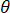
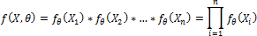
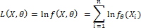

# Функция правдоподобия

Функция правдоподобия
-

# Функция правдоподобия

Метод максимального правдоподобия - способ построения оценки неизвестного параметра. Он состоит в том, что в качестве «наиболее правдоподобного» значения параметра берут значение , максимизирующее вероятность получить при n опытах данную выборку X = (X1, …, Xn). Это значение параметра  зависит от выборки.

При фиксированном  функция правдоподобия вычисляется следующим образом:

Логарифмическая функция правдоподобия вычисляется по следующей формуле:

См. также:

[Библиотека методов и моделей](../uimodelling_lib_common.htm)

		Справочная
		 система на версию 10.9
		 от 18/08/2025,
		 © ООО «ФОРСАЙТ»,
