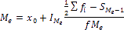

# Медиана

Медиана
-

# Медиана

Медиана (Me)
 - это значение варьирующего признака, приходящееся на середину ряда, расположенного
 в порядке возрастания или убывания числовых значений признака, т.е. величина
 изучаемого признака, которая находится в середине упорядоченного вариационного
 ряда. Главное свойство медианы в том, что сумма абсолютных отклонений
 значений признака от медианы меньше, чем от любой другой величины:

Для определения медианы в дискретном ряду при наличии частот, сначала
 исчисляется полусумма частот, а затем определяется значение варьирующего
 признака ему соответствующее. При исчислении медианы интервального ряда
 сначала определяются медианы интервалов, а затем определяется значение
 варьирующего признака, которое соответствует данной частоте. Для определения
 величины медианы используется формула:

Где:

	- x0. Нижняя граница
	 медианного интервала;

	- . Величина медианного
	 интервала;

	- . Накопленная частота
	 интервала, предшествующего медианному;

	- fMe.
	 Частота медианного интервала.

См. также:

[Библиотека методов и моделей](../uimodelling_lib_common.htm)
 | [IModelling.Median](KeMs.chm::/Interface/IModelling/IModelling.Median.htm)

		Справочная
		 система на версию 10.9
		 от 18/08/2025,
		 © ООО «ФОРСАЙТ»,
