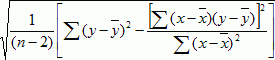

# Стандартная ошибка

Стандартная ошибка
-

# Стандартная ошибка

Стандартная ошибка - это мера ошибки предсказанного значения y для отдельного значения x.

Уравнение для стандартной ошибки предсказанного y имеет следующий вид:

Где:

-
x, y. Выборочные средние значения;

-
n. Размер выборки.

См. также:

[Библиотека методов и моделей](../uimodelling_lib_common.htm)

		Справочная
		 система на версию 10.9
		 от 18/08/2025,
		 © ООО «ФОРСАЙТ»,
