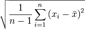
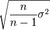
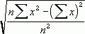

# Стандартное отклонение

Стандартное отклонение
-

# Стандартное отклонение

Стандартное отклонение - это мера того, насколько широко разбросаны
 точки данных относительно их среднего.

## Стандартное отклонение по выборке

Стандартное отклонение по выборке рассчитывается по следующей формуле:

Где:

	- x.
	 Выборочное среднее;

	- n.
	 Размер выборки.

## Исправленное стандартное отклонение по выборке

Исправленное стандартное отклонение по выборке рассчитывается по следующей
 формуле:

Где:

	- σ. [Исправленная
	 дисперсия](UIModelling_dispers.htm);

	- n.
	 Размер выборки.

## Стандартное отклонение по генеральной совокупности

Стандартное отклонение по генеральной совокупности рассчитывается по
 следующей формуле:

Где:

	- x.
	 Выборочное среднее;

	- n.
	 Размер выборки.

См. также:

[Библиотека методов и моделей](../uimodelling_lib_common.htm)
 | [IModelling.Stdv](KeMs.chm::/Interface/IModelling/IModelling.Stdv.htm)
 | [IStatistics.StDev](statlib.chm::/interface/IStatistics/IStatistics.StDev.htm)
 | [IStatistics.StDevP](statlib.chm::/interface/IStatistics/IStatistics.StDevP.htm)

		Справочная
		 система на версию 10.9
		 от 18/08/2025,
		 © ООО «ФОРСАЙТ»,
