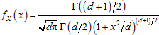
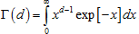

# Распределение Стьюдента

Распределение Стьюдента
-

# Распределение Стьюдента

Распределение Стьюдента с количеством степеней свободы d характеризуется функцией плотности вероятности:

Где Г - гамма-функция, имеющая вид:

В функции реализован алгоритм, основанный на том свойстве, что если случайная величина Y имеет стандартное нормальное распределение, величина Z имеет χ2-распределение с d степенями свободы, и при этом если Y и Z являются независимыми, то величина  имеет распределение Стьюдента с d степенями свободы. Поскольку распределение χ2(d) является частным случаем гамма-распределения и совпадает с Г(d/2, 2), то используется функция [гамма-распределения](Distribution/Lib_GammaDistribution.htm). Таким образом, для генерирования псевдослучайной величины X ~ t(d) выполняются следующие операции:

1. Генерируется выборка Y ~ N(0,1) из стандартного нормального распределения при помощи метода Бокса-Мюллера (см. описание [нормального распределения](Distribution/Lib_NormalDistribution.htm)).

2. При помощи функции [гамма-распределения](Distribution/Lib_GammaDistribution.htm) генерируется независимая от Y выборка из χ2-распределения с d степенями свободы Z ~ χ2(d) = Г(d/2, 2).

3. Вычисляются значения элементов искомой выборки .

См. также:

[ISmStudentDistribution](StatLib.chm::/Interface/ISmStudentDistribution/ISmStudentDistribution.htm) | [Библиотека методов и моделей](../uimodelling_lib_common.htm)

		Справочная
		 система на версию 10.9
		 от 18/08/2025,
		 © ООО «ФОРСАЙТ»,
