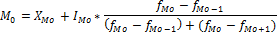

# Мода

Мода
-

# Мода

Мода - это наиболее часто встречающееся значение варьирующего признака в вариационном ряду. Модой распределения называется такая величина изучаемого признака, которая в данной совокупности встречается наиболее часто, т.е.  один из вариантов признака повторяется чаще, чем все другие.

Для дискретного ряда (ряд, в котором значение варьирующего признака представлены отдельными числовыми показателями) модой является значение варьирующего признака обладающего наибольшей частотой. Для интервального ряда сначала определяется модальный интервал (т.е. содержащий моду). В случае интервального распределения с равными интервалами определяется по наибольшей частоте; с неравными интервалами – по наибольшей плотности. Определение моды требует проведения расчетов на основе следующих формул:

В интервальном ряду мода находится по следующей формуле:

Где:

-
XMo. Минимальная граница модального интервала;

-
IMo. Величина модального интервала;

-
fMo. Частота модального интервала;

-
fMo-1. Частота интервала, предшествующего модальному;

-
fMo+1. Частота интервала, следующего за модальным.

См. также:

[Библиотека методов и моделей](../uimodelling_lib_common.htm) | [IModelling.Mode](KeMs.chm::/Interface/IModelling/IModelling.Mode.htm)

		Справочная
		 система на версию 10.9
		 от 18/08/2025,
		 © ООО «ФОРСАЙТ»,
