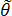
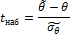
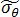

# t-статистика

t-статистика
-

# t-статистика

Для проверки статистической значимости каждого фактора регрессионной модели необходимо проверить гипотезу о равенстве коэффициента регрессии нулю (переменная, соответствующая данному коэффициенту регрессии не оказывает существенного влияния на Y): H0:  = 0 против гипотезы H1:  ≠ 0 (переменная оказывает существенное влияние на Y).

Для оценки статистической значимости коэффициентов (существенности факторов, входящих в состав модели) для факторов линейной регрессии применяется t-критерий Стьюдента. t-статистика вычисляется как отношение оценки коэффициента к его стандартной ошибке:

Где:

-
. Оценка коэффициента регрессии;

-
. Стандартное отклонение оценки параметра регрессии .

Стандартная ошибка (стандартное отклонение) – это приближённая величина отклонения оценки коэффициента от истинного значения, вызванного случайностью выборки. Чем больше значение стандартной ошибки, тем менее достоверна оценка коэффициента при объясняющей переменной.

См. также:

[Библиотека методов и моделей](../uimodelling_lib_common.htm)

		Справочная
		 система на версию 10.9
		 от 18/08/2025,
		 © ООО «ФОРСАЙТ»,
