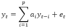
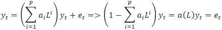
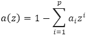
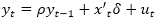

# Тесты на единичные корни

Тесты на единичные корни
-

# Тесты на единичные корни

Единичный корень - понятие, используемое в анализе временных рядов,
 характеризующее свойство некоторых нестационарных временных рядов. Название
 связано с тем, что характеристическое уравнение авторегрессионной модели
 временного ряда имеет корни, равные по модулю единице.

Пусть имеется авторегрессионная модель:

С помощью оператора лага L:
 Lxt = xt-1
 эту модель можно записать следующим образом:

Характеристическим полиномом данной модели называется полином вида:

Корни этого полинома (корни характеристического уравнения a(z)=0) в общем случае являются комплексными
 числами. Если все корни этого полинома лежат вне единичного круга комплексной
 плоскости (то есть по модулю строго больше единицы), то авторегрессионный
 процесс является стационарным. Если имеются корни, равные по модулю единице
 (теоретически могут быть и меньше единицы), то авторегрессионный процесс
 является нестационарным.

Рассмотрим модель процесса Ar(1):

где yt
 - тестируемый ряд, xt - экзогенный регрессор, который может
 содержать константу, тренд или константу и тренд, ρ
 и δ – оцениваемые параметры и
 ut
 - остатки модели. Существует ряд тестов для определения единичных корней:

	- [Расширенный тест Дики-Фуллера](AugmentDickeyFullerTest.htm);

	- Обобщенный тест Дики-Фуллера;

	- Тест Филлипса-Перрона;

	- Теста Квятковского-Филлипса-Шмидта-Шина;

	- Тест Эллиота-Розенберга-Стокса;

	- Тест Нг-Перрона.

См. также:

[Библиотека методов и моделей](../uimodelling_lib_common.htm)

		Справочная
		 система на версию 10.9
		 от 18/08/2025,
		 © ООО «ФОРСАЙТ»,
