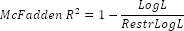

# Критерии качества модели бинарного выбора

Критерии качества модели бинарного выбора
-

# Критерии качества модели бинарного выбора

Ввиду особенностей [моделей
 бинарного выбора](../01_Regression_models/UiModelling_BinaryModel.htm) качество модели оценивается по статистикам, отличным
 от [коэффициента детерминации](UiModellind_DetermCoeff_R2.htm)
 и [статистики Фишера](UiModelling_Fisher.htm) для модели регрессии.

## Остаток логарифма функции правдоподобия

Остаток логарифма функции правдоподобия RestrLogL
 - это значение логарифма [функции максимального
 правдоподобия](UiModelling_LogL.htm) ограниченной модели (модели, в которой исключены все
 факторы). Используется для построения коэффициента детерминации Макфаддена
 и LR-статистики.

## Среднее логарифма функции правдоподобия

Среднее логарифма функции правдоподобия рассчитывается по формуле:

LogL/T

Где:

	- LogL. Значение логарифма
	 [функции максимального правдоподобия](UiModelling_LogL.htm)
	 рассчитанной модели;

	- T. Число наблюдений.

## Коэффициент детерминации Макфаддена

Коэффициент детерминации Макфаддена является аналогом обычного [коэффициента
 детерминации](UiModellind_DetermCoeff_R2.htm) и применяется для оценки качества моделей бинарного выбора.

Коэффициент детерминации Макфаддена рассчитывается по формуле:

Где:

	- LogL. Значение логарифма
	 [функции максимального правдоподобия](UiModelling_LogL.htm)
	 рассчитанной модели;

	- RestLogL. Остаток логарифма
	 функции правдоподобия.

## LR-статистика и вероятность LR-статистики

LR-статистика является аналогом [статистики
 Фишера](UiModelling_Fisher.htm) и проверяет гипотезу о незначимости всех факторов модели. Рассчитывается
 по формуле:

LR = -2(RestLog - LogL)

Где:

	- LogL. Значение логарифма
	 [функции максимального правдоподобия](UiModelling_LogL.htm)
	 рассчитанной модели;

	- RestLogL. Остаток логарифма
	 функции правдоподобия.

Статистика имеет распределение Хи-квадрат X2(k-1),
 где k - это число факторов регрессии
 не включая константу. Нулевая гипотеза о равенстве нулю коэффициентов
 при всех регрессорах отклоняется, если вероятность меньше, чем уровень
 значимости. Рассматривают один из стандартных уровней значимости 0.1,
 0.05 или 0.01.

Вычисляется, только если модель содержит константу.

См. также:

[Библиотека методов и моделей](../uimodelling_lib_common.htm)
 | [Скорректированный
 коэффициент детерминации](UiModellind_DetermCoeff_AdjR2.htm) | [ISummaryStatistics.McFaddenRsquared](StatLib.chm::/Interface/ISummaryStatistics/ISummaryStatistics.McFaddenRsquared.htm)
 | [ISummaryStatistics.AvgLogL](StatLib.chm::/Interface/ISummaryStatistics/ISummaryStatistics.AvgLogL.htm)
 | [ISummaryStatistics.RestrLogL](StatLib.chm::/Interface/ISummaryStatistics/ISummaryStatistics.RestrLogL.htm)
 | [ISummaryStatistics.LRstatistic](StatLib.chm::/Interface/ISummaryStatistics/ISummaryStatistics.LRstatistic.htm)
 | [ISummaryStatistics.LRprobability](StatLib.chm::/Interface/ISummaryStatistics/ISummaryStatistics.LRprobability.htm)

		Справочная
		 система на версию 10.9
		 от 18/08/2025,
		 © ООО «ФОРСАЙТ»,
