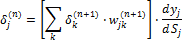
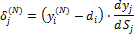
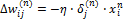
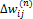
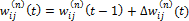

# Сеть обратного распространения

Сеть обратного распространения
-

# Сеть обратного распространения

Нейронная сеть обратного распространения - это мощнейший инструмент
 поиска закономерностей, прогнозирования, качественного анализа. Название
 «Сеть обратного распространения» (англ. back propagation) она получили
 из-за используемого алгоритма обучения, в котором ошибка распространяется
 от выходного слоя к входному, т.е. в направлении, противоположном
 направлению распространения сигнала при нормальном функционировании сети.

Нейронная сеть обратного распространения состоит из нескольких слоев
 нейронов, причем каждый нейрон слоя *i* связан с каждым нейроном
 слоя *i+1*.

В общем случае задача обучения нейронной сети сводится к нахождению
 некой функциональной зависимости Y=F(X),
 где *X* - входной, а *Y* - выходной векторы. В общем случае
 такая задача, при ограниченном наборе входных данных, имеет бесконечное
 множество решений. Для ограничения пространства поиска при обучении ставится
 задача минимизации целевой функции ошибки нейронной сети, которая находится
 по [методу
 наименьших квадратов](../01_Regression_models/UiModelling_LinearRegr_LSM.htm):

*,

где:

	- yj*. Значение j-го
	 выхода нейросети;

	- *dj*.
	 Целевое значение j-го выхода;

	- *p*. Число
	 нейронов в выходном слое.

Обучение нейросети производится методом градиентного спуска, т.е. на
 каждой итерации изменение веса производится по формуле:

*, (1)

где h* - параметр, определяющий скорость обучения.

*, (2)

где:

	- yj*. Значение выхода j-го
	 нейрона;

	- *Sj*.
	 Взвешенная сумма входных сигналов, рассчитываемая по формуле:

*,

где:

		- n*. Число входов нейрона;

		- *xi*.
		 Значение i-го входа нейрона;

		- *wi*.
		 Вес i-го синапса.

При этом множитель:

*,

	где xi* - значение
	 i-го входа нейрона.

Рассмотрим определение первого множителя формулы (2):

*,

где k* - число нейронов в слое *n+1*.

Введем вспомогательную переменную:

*

Тогда возможно определить рекурсивную формулу для определения n*-ного
 слоя, если нам известно значение следующего *(n+1)*-го
 слоя:

 (3)

Вычисления для последнего слоя нейросети не представляют трудности,
 так как известен целевой вектор, т.е. вектор тех значений, которые
 должна выдавать сеть при данном наборе входных значений:

 (4)

Запишем формулу (1) в раскрытом виде:

 (5)

Рассмотрим полный алгоритм обучения нейросети:

	- Подать на вход сети один из требуемых образов и определить значения
	 выходов нейронов;

	- Рассчитать для выходного слоя нейросети по формуле (4) и рассчитать
	 изменения весов выходного слоя N
	 по формуле (5);

	- Рассчитать по формулам (3) и (5)  для остальных
	 слоев сети, n = N-1..1;

	- Скорректировать все веса нейросети:

	- Если ошибка существенна, то перейти на шаг 1.

См. также:

[Библиотека методов и моделей](../uimodelling_lib_common.htm)
 | [Заполнение
 по шаблону](DataMining.chm::/Master/Methods/DataMining_PatternSubst.htm) | [ISmBackPropagation](StatLib.chm::/Interface/ISmBackPropagation/ISmBackPropagation.htm)

		Справочная
		 система на версию 10.9
		 от 18/08/2025,
		 © ООО «ФОРСАЙТ»,
