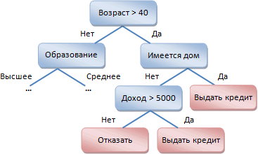

# Дерево решений

Дерево решений
-

# Дерево решений

Дерево решений - это способ представления правил в иерархической, последовательной
 структуре, где каждому объекту соответствует единственный узел, дающий
 решение.

Под правилом понимается логическая конструкция, представленная в виде
 «если …, то …». Например:

Дерево состоит из внутренних узлов, содержащих проверку условия, и листьев,
 являющихся решениями.

## Построение дерева решений

Пусть нам задано некоторое множество T,
 содержащее объекты, каждый из которых характеризуется m
 атрибутами, причем один из них указывает на принадлежность объекта к определенному
 классу.

Идею построения дерева решений из множества T,
 впервые высказанную Хантом, приведем по Р. Куинлену (R. Quinlan).

Пусть через {C1,
 C2, … Ck} обозначены классы, тогда
 возможны следующие ситуации:

	- Множество T содержит
	 один или более объектов, относящихся к одному классу Ck. Тогда дерево решений для
	 Т - это лист, определяющий
	 класс Ck;

	- Множество T
	 не содержит ни одного примера, т.е. пустое множество. Тогда это
	 снова лист, и класс, ассоциированный с листом, выбирается из другого
	 множества отличного от T,
	 например, из множества, ассоциированного с родителем;

	- Множество T содержит
	 объекты, относящиеся к разным классам. В этом случае следует разбить
	 множество T на некоторые
	 подмножества. Для этого выбирается один из атрибутов, имеющий два
	 и более отличных друг от друга значений O1,
	 O2, … On. T
	 разбивается на подмножества T1,
	 T2, … Tn, где каждое подмножество
	 Ti
	 содержит все объекты, имеющие значение Oi для выбранного атрибута.
	 Эта процедура будет рекурсивно продолжаться до тех пор, пока конечное
	 множество не будет состоять из объектов, относящихся к одному и тому
	 же классу.

Вышеописанная процедура лежит в основе многих современных алгоритмов
 построения дерева решений, этот метод известен еще под названием разделения
 и захвата. При использовании данной методики, построение дерева решений
 будет происходит сверху вниз.

Поскольку все объекты были заранее отнесены к известным нам классам,
 такой процесс построения дерева решений называется обучением с учителем.
 Процесс обучения также называют индуктивным обучением или индукцией дерева.

См. также:

[Библиотека методов и моделей](../uimodelling_lib_common.htm)
 | [Заполнение
 по шаблону](DataMining.chm::/Master/Methods/DataMining_PatternSubst.htm) | [ISmDecisionTree](StatLib.chm::/Interface/ISmDecisionTree/ISmDecisionTree.htm)

		Справочная
		 система на версию 10.9
		 от 18/08/2025,
		 © ООО «ФОРСАЙТ»,
