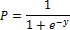

# Логистическая регрессия

Логистическая регрессия
-

# Логистическая регрессия

Логистическая регрессия - это разновидность множественной регрессии,
 общее назначение которой состоит в анализе связи между несколькими независимыми
 переменными (называемыми также регрессорами или предикторами) и зависимой
 переменной. Бинарная логистическая регрессия применяется, если зависимая
 переменная является бинарной (т.е. может принимать только два значения).
 Иными словами, с помощью логистической регрессии можно оценивать вероятность
 того, что событие наступит для конкретного испытуемого (больной/здоровый,
 возврат кредита/дефолт и т.д.).

Все регрессионные модели могут быть записаны в виде формулы:

В множественной линейной регрессии предполагается, что зависимая переменная
 является линейной функцией независимых переменных:

Данную регрессию можно использовать для задачи оценки вероятности исхода
 события, вычислив стандартные коэффициенты регрессии. Например, если рассматривается
 исход по займу, задается переменная y со значениями 1 и 0, где 1 означает,
 что соответствующий заемщик расплатился по кредиту, а 0, что имел место
 дефолт. Возникает проблема: множественная регрессия не учитывает, что
 переменная отклика бинарна по своей природе. Это приведет к модели с предсказываемыми
 значениями большими 1 и меньшими 0. Но такие значения не допустимы для
 первоначальной задачи. Таким образом, множественная регрессия просто игнорирует
 ограничения на диапазон значений для y.

Для решения проблемы задача регрессии может быть сформулирована иначе:
 вместо предсказания бинарной переменной, предсказывается непрерывная переменная
 со значениями на отрезке [0, 1] при любых значениях независимых переменных.
 Это достигается применением следующего регрессионного уравнения (логит-преобразование):

,

где:

	- P.
	 Вероятность того, что произойдет интересующее событие;

	- e.
	 Основание натуральных логарифмов 2,71…;

	- y.
	 Стандартное уравнение регрессии.

См. также:

[Библиотека методов и моделей](../uimodelling_lib_common.htm)
 | [Заполнение
 по шаблону](DataMining.chm::/Master/Methods/DataMining_PatternSubst.htm) | [ISmLogisticRegression](StatLib.chm::/Interface/ISmLogisticRegression/ISmLogisticRegression.htm)

		Справочная
		 система на версию 10.9
		 от 18/08/2025,
		 © ООО «ФОРСАЙТ»,
