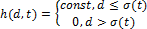
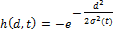
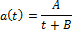

# Самоорганизующиеся карты Кохонена

Самоорганизующиеся карты Кохонена
-

# Самоорганизующиеся карты Кохонена

Самоорганизующиеся карты - это одна из разновидностей нейросетевых алгоритмов.
 Основным отличием данной сети, обучаемой по алгоритму обратного распространения,
 является то, что при обучении используется метод обучения без учителя,
 то есть результат обучения зависит только от структуры входных данных.
 Нейронные сети данного типа часто применяются для решения самых различных
 задач, от восстановления пропусков в данных до анализа данных и поиска
 закономерностей.

Алгоритм функционирования самообучающихся карт (англ. Self
 Organizing Maps - SOM)
 представляет собой один из вариантов кластеризации многомерных векторов.
 Важным отличием алгоритма SOM является то, что в нем все нейроны (узлы,
 центры классов) упорядочены в некоторую структуру (обычно двумерную сетку).
 В ходе обучения модифицируется не только нейрон-победитель, но и его соседи
 (в меньшей степени). За счет этого SOM можно считать одним из методов
 проецирования многомерного пространства в пространство с более низкой
 размерностью. При использовании этого алгоритма вектора, схожие в исходном
 пространстве, оказываются рядом и на полученной карте.

SOM подразумевает использование упорядоченной структуры нейронов. Обычно
 используются одно и двумерные сетки. При этом каждый нейрон представляет
 собой n-мерный вектор-столбец:

,

где n определяется размерностью
 исходного пространства (размерностью входных векторов). Применение одно
 и двумерных сеток связано с тем, что возникают проблемы при отображении
 пространственных структур большей размерности (при этом опять возникают
 проблемы с понижением размерности до двумерной, представимой на мониторе).

Обычно нейроны располагаются в узлах двумерной сетки с прямоугольными
 или шестиугольными ячейками. При этом, как было сказано выше, нейроны
 также взаимодействуют друг с другом. Величина этого взаимодействия определяется
 расстоянием между нейронами на карте.

При этом количество нейронов в сетке определяет степень детализации
 результата работы алгоритма, и от этого зависит точность обобщающей способности
 карты.

## Начальная инициализация карты

При реализации алгоритма SOM заранее задается конфигурация сетки (прямоугольная
 или шестиугольная), а также количество нейронов в сети. В некоторых случаях
 рекомендуют использовать максимально возможное количество нейронов в карте.
 При этом начальный радиус обучения в значительной степени влияет на способность
 обобщения при помощи полученной карты. Если количество узлов карты превышает
 количество примеров в обучающей выборке, то успех использования алгоритма
 в большой степени зависит от подходящего выбора начального радиуса обучения.
 Если размер карты составляет десятки тысяч нейронов, то время, требуемое
 на обучение карты, обычно, бывает слишком велико для решения практических
 задач. Таким образом, необходимо достигать допустимого компромисса при
 выборе количества узлов.

Перед началом обучения карты необходимо проинициализировать весовые
 коэффициенты нейронов. Удачно выбранный способ инициализации может существенно
 ускорить обучение, и привести к получению более качественных результатов.
 Существуют три способа инициирования начальных весов:

	- Инициализация случайными значениями, когда всем весам даются
	 малые случайные величины;

	- Инициализация примерами, когда в качестве начальных значений
	 задаются значения случайно выбранных примеров из обучающей выборки;

	- Линейная инициализация. В этом случае веса инициируются значениями
	 векторов, линейно упорядоченных вдоль линейного подпространства, проходящего
	 между двумя главных собственными векторами исходного набора данных.

## Обучение

Обучение состоит из последовательности коррекций векторов, представляющих
 собой нейроны. На каждом шаге обучения из исходного набора данным случайно
 выбирается один из векторов, а затем производится поиск наиболее похожего
 на него вектора коэффициентов нейронов. При этом выбирается нейрон-победитель,
 который наиболее похож на вектор входов. Под похожестью в данной задаче
 понимается расстояние между векторами, обычно вычисляемое в евклидовом
 пространстве. Таким образом, если обозначить нейрон-победитель как c,
 то получим:

После того, как найден нейрон-победитель, производится корректировка
 весов нейросети. При этом вектор, описывающий нейрон-победитель, и вектора,
 описывающие его соседей в сетке, перемещаются в направлении входного вектора.

При этом для модификации весовых коэффициентов используется формула:

,

где t обозначает номер эпохи
 (дискретное время). При этом вектор x(t) выбирается случайно из обучающей
 выборки на итерации t. Функция
 h(t)
 называется функцией соседства нейронов. Эта функция представляет собой
 невозрастающую функцию от времени и расстояния между нейроном-победителем
 и соседними нейронами в сетке. Эта функция разбивается на две части: собственно
 функцию расстояния и функции скорости обучения от времени.

Обычно применяется одни из двух функций от расстояния:

	- простая константа:

	- Гауссова функция:

При этом лучший результат получается при использовании Гауссовой функции
 расстояния. При этом является убывающей функцией от времени. Часто эту
 величину называют радиусом обучения, который выбирается достаточно большим
 на начальном этапе обучения и постепенно уменьшается так, что в конечном
 итоге обучается один нейрон-победитель. Наиболее часто используется функция,
 линейно убывающая от времени.

Рассмотрим функцию скорости обучения a(t). Эта функция также представляет
 собой функцию, убывающую от времени. Наиболее часто используются два варианта
 этой функции: линейная и обратно пропорциональная времени вида:

,

где A и B
 - это константы. Применение этой функции приводит к тому, что все вектора
 из обучающей выборки вносят примерно равный вклад в результат обучения.

Обучение состоит из двух основных фаз: на первоначальном этапе выбирается
 достаточно большое значение скорости обучения и радиуса обучение, что
 позволяет расположить вектора нейронов в соответствии с распределением
 примеров в выборке, а затем производится точная подстройка весов, когда
 значения параметров скорости обучения много меньше начальных. В случае
 использования линейной инициализации первоначальный этап грубой подстройки
 может быть пропущен.

См. также:

[Библиотека методов и моделей](../uimodelling_lib_common.htm)
 | [Определение
 категорий](DataMining.chm::/Master/Methods/DataMining_CategDetect.htm) | [ISmSelfOrganizingMap](StatLib.chm::/Interface/ISmSelfOrganizingMap/ISmSelfOrganizingMap.htm)

		Справочная
		 система на версию 10.9
		 от 18/08/2025,
		 © ООО «ФОРСАЙТ»,
