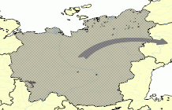
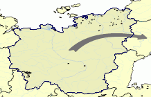
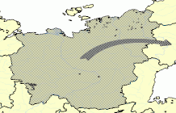

# MapViewSelectionMode

MapViewSelectionMode
-

# MapViewSelectionMode

## Описание

Перечисление MapViewSelectionMode
 содержит режимы выделения территорий карты.

Используется следующим свойством:

	- [IMapView.SelectionMode](../Interface/IMapView/IMapView.SelectionMode.htm).

## Допустимые значения

		 Значение
		 Краткое описание

		 1
		 Fill. Заливка территории
		 по шаблону.

		 2
		 Border. Выделение границы
		 территории.

		 3
		 FillAndArrow. Заливка
		 территории и стрелок, идущих с неё, по шаблону.

См. также:

[Перечисления сборки Map](Map_Enums.htm)

		Справочная
		 система на версию 10.9
		 от 18/08/2025,
		 © ООО «ФОРСАЙТ»,
