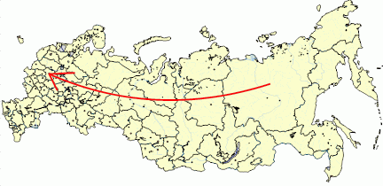

# IMapArrow.Angle

IMapArrow.Angle
-

# IMapArrow.Angle

## Синтаксис

Angle: Double;

## Описание

Свойство Angle определяет угол
 изгиба стрелки.

## Комментарии

Допустимые значения находятся в диапазоне [0, 90) или [0, -90).

## Пример

Данный модуль подключается к регламентному отчету, на листе которого
 расположена карта.

Добавьте ссылки на системные сборки: Drawing, Map, Report, Tab.

	Sub Arrow;

	Var

	    Map : IMap;

	    Arrow : IMapArrow;

	Begin

	    Map := PrxReport.ActiveReport.ActiveSheet.Table.Objects.Item(0).Extension As IMap;

	    Arrow := Map.Layers.FindByName("Regions").Arrows.CreateByIDs(98,46);

	    Arrow.Color:= GxColor.FromName("Red");

	    Arrow.Angle := 30;

	    Map.Refresh;

	End Sub Arrow;

После выполнения примера будет создана стрелка с заданным цветом и изгибом:

См. также:

[IMapArrow](IMapArrow.htm)

		Справочная
		 система на версию 10.9
		 от 18/08/2025,
		 © ООО «ФОРСАЙТ»,
