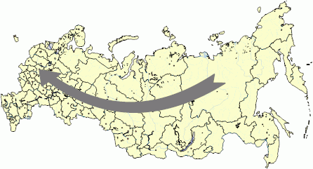

# IMapArrow.CapLength

IMapArrow.CapLength
-

# IMapArrow.CapLength

## Синтаксис

CapLength: Double;

## Описание

Свойство CapLength определяет
 длину указателя стрелки.

## Комментарии

Длина указателя определяется как доля от длины отрезка между точками
 привязки соединяемых территорий. Допустимые значения находятся в диапазоне
 [0,0; 1,0].

Примечание.
 Данное свойство работает, если свойство [IMapArrow.Shape](IMapArrow.Shape.htm)
 имеет значение [MapArrowShape.Simple](../../Enums/MapArrowShape.htm)
 или [MapArrowShap.Tailed](../../Enums/MapArrowShape.htm).

## Пример

Для выполнения примера предполагается наличие на форме компонентов Button,
 MapBox, UiMap с наименованиями Button1, MapBox1 и UiMap1 соответственно.
 UiMap1 является источником данных для MapBox1. К компоненту UiMap1 должна
 быть подключена карта.

Пример является обработчиком события OnClick для компонента Button1.

Добавьте ссылки на системные сборки: ExtCtrls, Forms, Map.

	Sub Button1OnClick(Sender: Object; Args: IMouseEventArgs);

	Var

	    Maps: IMap;

	    Layer: IMapLayer;

	    Arrows: IMapLayerArrows;

	    Arrow: IMapArrow;

	Begin

	    Maps := UiMap1.Map;

	    Layer := Maps.Layers.FindByName("Regions");

	    Arrows := Layer.Arrows;

	    Arrows.CreateByIDs(98, 46);

	    Arrow := Arrows.Item(0);

	    Arrow.Shape:=MapArrowShape.Tailed;

	    Arrow.CapLength := 0.1;

	End Sub Button1OnClick;

После выполнения примера будет создана стрелка с заданной длиной указателя:

См. также:

[IMapArrow](IMapArrow.htm)

		Справочная
		 система на версию 10.9
		 от 18/08/2025,
		 © ООО «ФОРСАЙТ»,
