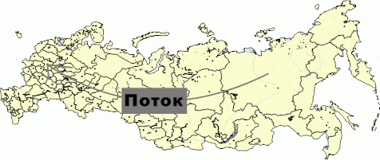

# IMapArrow.Font

IMapArrow.Font
-

# IMapArrow.Font

## Синтаксис

Font: [IGxFont](ModDrawing.chm::/Interface/IGxFont/IGxFont.htm);

## Описание

Свойство Font определяет параметры
 шрифта подписи стрелки.

## Пример

Данный модуль подключается к регламентному отчету, на листе которого
 расположена карта.

Добавьте ссылки на системные сборки: Drawing, Map, Report, Tab.

	Sub Arrow;

	Var

	    Map: IMap;

	    Layer: IMapLayer;

	    Arrows: IMapLayerArrows;

	    Arrow: IMapArrow;

	Begin

	    Map := PrxReport.ActiveReport.ActiveSheet.Table.Objects.Item(0).Extension As IMap;

	    Layer := Map.Layers.FindByName("Regions");

	    Arrows := Layer.Arrows;

	    Arrows.CreateByIDs(98, 46);

	    Arrow := Arrows.Item(0);

	    Arrow.Text := "Поток";

	    Arrow.Font := New GxFont.Create("Arial Black", 16, 1 As GxFontStyle, 3 As GxUnit);

	    Map.Refresh;

	End Sub Arrow;

После выполнения примера будет создана стрелка и задан текст подписи
 к ней с соответствующими параметрами шрифта:

См. также:

[IMapArrow](IMapArrow.htm)

		Справочная
		 система на версию 10.9
		 от 18/08/2025,
		 © ООО «ФОРСАЙТ»,
