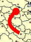

# IMapArrow.Pen

IMapArrow.Pen
-

# IMapArrow.Pen

## Синтаксис

Pen: [IGxPen](ModDrawing.chm::/Interface/IGxPen/IGxPen.htm);

## Описание

Свойство Pen определяет параметры
 линии и наконечника стрелки.

## Пример

Для выполнения примера предполагается наличие на форме компонентов Button,
 MapBox, UiMap с наименованиями Button1, MapBox1 и UiMap1 соответственно.
 UiMap1 является источником данных для MapBox1. К компоненту UiMap1 должна
 быть подключена карта.

Пример является обработчиком события OnClick для компонента Button1.

Добавьте ссылки на системные сборки: Drawing, ExtCtrls, Forms, Map.

	Sub Button1OnClick(Sender: Object; Args: IMouseEventArgs);

	Var

	    Maps: IMap;

	    Layer: IMapLayer;

	    Arrows: IMapLayerArrows;

	    Arrow: IMapArrow;

	    Pen: IGxPen;

	Begin

	    Maps := UiMap1.Map;

	    Layer := Maps.Layers.FindByName("Regions");

	    Arrows := Layer.Arrows;

	    Arrows.CreateByIDs(56, 46);

	    Arrow := Arrows.Item(0);

	    Pen := New GxPen.CreateSolid(GxColor.FromName("Red"), 2);

	    Pen.EndCap := GxLineCap.RoundAnchor;

	    Arrow.Pen := Pen;

	End Sub Button1OnClick;

После выполнения примера будет создана стрелка с заданными параметрами
 линии и наконечника:

См. также:

[IMapArrow](IMapArrow.htm)

		Справочная
		 система на версию 10.9
		 от 18/08/2025,
		 © ООО «ФОРСАЙТ»,
