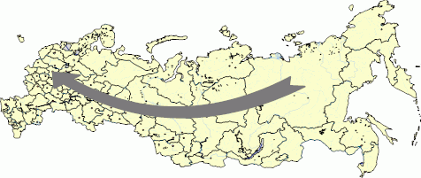

# IMapArrow.Shape

IMapArrow.Shape
-

# IMapArrow.Shape

## Синтаксис

Shape: [MapArrowShape](../../Enums/MapArrowShape.htm);

## Описание

Свойство Shape определяет тип
 стрелки. По умолчанию используется стрелка в виде простой линии.

## Пример

Данный модуль подключается к регламентному отчету, на листе которого
 расположена карта.

Добавьте ссылки на системные сборки: Map, Report, Tab.

	Sub Arrow;

	Var

	    Sheets: IPrxSheets;

	    SheetT : IPrxTable;

	    Map: IMap;

	    Layer: IMapLayer;

	    Arrows: IMapLayerArrows;

	    Arrow: IMapArrow;

	Begin

	    Sheets := PrxReport.ActiveReport.Sheets;

	    SheetT := Sheets.Item(0) As  IPrxTable;

	    Map := SheetT.TabSheet.Objects.Item(0).Extension As IMap;

	    Layer := Map.Layers.FindByName("Regions");

	    Arrows := Layer.Arrows;

	    Arrows.CreateByIDs(98, 46);

	    Arrow := Arrows.Item(0);

	    Arrow.Shape := MapArrowShape.Tailed;

	    Map.Refresh;

	End Sub Arrow;

После выполнения примера будет создана стрелка заданного типа:

См. также:

[IMapArrow](IMapArrow.htm)

		Справочная
		 система на версию 10.9
		 от 18/08/2025,
		 © ООО «ФОРСАЙТ»,
