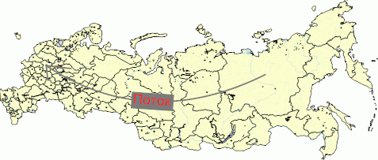

# IMapArrow.Text

IMapArrow.Text
-

# IMapArrow.Text

## Синтаксис

Text: String;

## Описание

Свойство Text определяет текст
 подписи стрелки.

## Пример

Данный модуль подключается к регламентному отчету, на листе которого
 расположена карта.

Добавьте ссылки на системные сборки: Drawing, Map, Report, Tab.

	Sub Arrow;

	Var

	    Sheets: IPrxSheets;

	    SheetT : IPrxTable;

	    Map: IMap;

	    Layer: IMapLayer;

	    Arrows: IMapLayerArrows;

	    Arrow: IMapArrow;

	Begin

	    Sheets := PrxReport.ActiveReport.Sheets;

	    SheetT := Sheets.Item(0) As  IPrxTable;

	    Map := SheetT.TabSheet.Objects.Item(0).Extension As IMap;

	    Layer := Map.Layers.FindByName("Regions");

	    Arrows := Layer.Arrows;

	    Arrows.CreateByIDs(98, 46);

	    Arrow := Arrows.Item(0);

	    // Зададим текст подписи стрелки

	    Arrow.Text := "Поток";

	    // Зададим цвет фона подписи

	    Arrow.TextBackgroundColor := GxColor.FromName("Grey");

	    // Зададим ориентацию подписи

	    Arrow.TextDirection := MapArrowTextDirection.Rotated;

	    // Зададим цвет подписи стрелки

	    Arrow.TextForegroundColor := GxColor.FromName("Red");

	    Map.Refresh;

	End Sub Arrow;

После выполнения примера будет создана стрелка, задан текст подписи
 к ней с соответствующими ориентацией, цветом фона и цветом подписи:

См. также:

[IMapArrow](IMapArrow.htm)

		Справочная
		 система на версию 10.9
		 от 18/08/2025,
		 © ООО «ФОРСАЙТ»,
