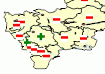

# IMapIconScale.AutoSetup

IMapIconScale.AutoSetup
-

# IMapIconScale.AutoSetup

## Синтаксис

AutoSetup(

Layer: [IMapLayer](../IMapLayer/IMapLayer.htm);

DataAdapter: Object;

Image: [IGxImage](ModDrawing.chm::/Interface/IGxImage/IGxImage.htm);

ColCount: Integer;

RowCount: Integer;

Count: Integer);

## Параметры

Layer. Слой, содержащий показатель;

DataAdapter. Источник данных,
 в соответствии с которым будет определяться пиктограмма;

Image. Изображение с пиктограммами
 для значений шкалы;

ColCount. Количество столбцов
 в изображении с пиктограммами;

RowCount. Количество строк
 в изображении с пиктограммами;

Count. Количество делений шкалы.

## Описание

Метод AutoSetup осуществляет
 автоматическую настройку шкалы.

## Пример

Для выполнения примера предполагается наличие на форме компонентов Button,
 MapBox, UiMap с наименованиями Button1, MapBox1 и UiMap1 соответственно.
 UiMap1 является источником данных для MapBox1. К компоненту UiMap1 должна
 быть подключена карта. Также должен быть реализован класс VisualDataAdapter,
 создающий динамический источник данных. Пример данного класса содержится
 в описании свойства [IMapVisual.DataAdapter](../IMapVisual/IMapVisual.DataAdapter.htm). В
 файловой системе должен присутствовать файл «C:\Icons.gif», содержащий
 пиктограммы для шкалы.

Пример является обработчиком события OnClick для компонента Button1.

Добавьте ссылки на системные сборки: Drawing, ExtCtrls, Forms, Map.

	Sub Button1OnClick(Sender: Object; Args: IMouseEventArgs);

	Var

	    Map: IMap;

	    Layer: IMapLayer;

	    ImageVisual: IMapImageVisual;

	    ImageProp: IMapVisualIconProperty;

	    Scale: IMapIconScale;

	Begin

	    Map := UiMap1.Map;

	    Layer := Map.Layers.FindByName("Regions");

	    ImageVisual := Layer.Visuals.AddImageVisual;

	    ImageVisual.DataAdapter := New VisualDataAdapter.Create As IMapDynamicDataAdapter;

	    ImageProp := ImageVisual.Image;

	    ImageProp.DataAdapter := ImageVisual.DataAdapter;

	    ImageVisual.Height.Value := 2;

	    ImageVisual.Width.Value := 2;

	    ImageProp.Dependent := True;

	    Scale := ImageProp.Scale;

	    Scale.AutoSetup(Layer, ImageVisual.DataAdapter, GxImage.FromFile("C:\Icons.gif"), 2, 1, 2);

	End Sub Button1OnClick;

После выполнения примера на слой «Regions» будет добавлен пиктографический
 показатель. Шкала для него будет настроена автоматически:

Пиктограммы будут взяты из файла «C:\Icons.gif»: .

См. также:

[IMapIconScale](IMapIconScale.htm)

		Справочная
		 система на версию 10.9
		 от 18/08/2025,
		 © ООО «ФОРСАЙТ»,
