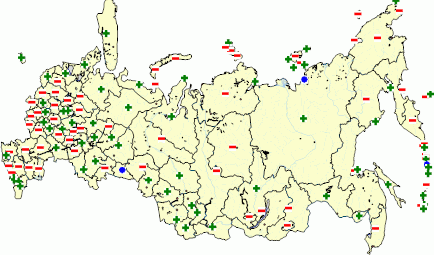
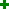
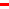
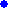

# IMapIconScale.Icon

IMapIconScale.Icon
-

# IMapIconScale.Icon

## Синтаксис

Icon(Index: Integer; Impact: [MapScaleSettingImpact](../../Enums/MapScaleSettingImpact.htm)):
 [IGxImage](ModDrawing.chm::/Interface/IGxImage/IGxImage.htm);

## Параметры

Index. Индекс деления шкалы;

Impact.
 Положение относительно значения деления шкалы.

## Описание

Свойство Icon определяет пиктограмму
 для заданного значения деления шкалы.

## Пример

Для выполнения примера предполагается наличие на форме компонентов Button,
 MapBox, UiMap с наименованиями Button1, MapBox1 и UiMap1 соответственно.
 UiMap1 является источником данных для MapBox1. К компоненту UiMap1 должна
 быть подключена карта. Также должен быть реализован класс VisualDataAdapter,
 создающий динамический источник данных. Пример данного класса содержится
 в описании свойства [IMapVisual.DataAdapter](../IMapVisual/IMapVisual.DataAdapter.htm). В
 файловой системе должны присутствовать файлы «C:\Greater.gif», «C:\Exact.gif»
 и «C:\Less.gif», содержащие изображение.

Пример является обработчиком события OnClick для компонента Button1.

Добавьте ссылки на системные сборки: Drawing, ExtCtrls, Forms, Map.

	Sub Button1OnClick(Sender: Object; Args: IMouseEventArgs);

	Var

	    Map: IMap;

	    Layer: IMapLayer;

	    ImageVisual: IMapImageVisual;

	    ImageProp: IMapVisualIconProperty;

	    Scale: IMapIconScale;

	Begin

	    Map := UiMap1.Map;

	    Layer := Map.Layers.FindByName("Regions");

	    ImageVisual := Layer.Visuals.AddImageVisual;

	    ImageVisual.DataAdapter := New VisualDataAdapter.Create As IMapDynamicDataAdapter;

	    ImageProp := ImageVisual.Image;

	    ImageProp.DataAdapter := ImageVisual.DataAdapter;

	    ImageVisual.Height.Value := 2;

	    ImageVisual.Width.Value := 2;

	    ImageProp.Dependent := True;

	    Scale := ImageProp.Scale;

	    Scale.Count := 1;

	    Scale.Value(0) := 50;

	    Scale.Icon(0, MapScaleSettingImpact.Greater) := GxImage.FromFile("C:\Greater.gif");

	    Scale.Icon(0, MapScaleSettingImpact.Exact) := GxImage.FromFile("C:\Exact.gif");

	    Scale.Icon(0, MapScaleSettingImpact.Less) := GxImage.FromFile("C:\Less.gif");

	End Sub Button1OnClick;

После выполнения примера на слой «Regions» будет добавлен пиктографический
 показатель. Пиктограмма показателя будет определяться шкалой:

Значения больше пятидесяти обозначаются пиктограммой ;
 значения меньше пятидесяти - ;
 значения равные пятидесяти - .

См. также:

[IMapIconScale](IMapIconScale.htm)

		Справочная
		 система на версию 10.9
		 от 18/08/2025,
		 © ООО «ФОРСАЙТ»,
