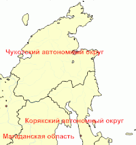

# IMapLayer.Font

IMapLayer.Font
-

# IMapLayer.Font

## Синтаксис

Font: [IGxFont](ModDrawing.chm::/Interface/IGxFont/IGxFont.htm);

## Описание

Свойство Font определяет параметры
 шрифта подписи слоя карты.

## Пример

Данный модуль подключается к регламентному отчету, на листе которого
 расположена карта.

Добавьте ссылки на системные сборки: Drawing, Map, Report, Tab.

	Sub LayerFont;

	Var

	    Sheets: IPrxSheets;

	    SheetT : IPrxTable;

	    Map : IMap;

	    Layer : IMapLayer;

	Begin

	    Sheets := PrxReport.ActiveReport.Sheets;

	    SheetT := Sheets.Item(0) As  IPrxTable;

	    Map := SheetT.TabSheet.Objects.Item(0).Extension As IMap;

	    Layer := Map.Layers.FindByName("Regions");

	    // Зададим параметры шрифта подписи слоя карты

	    Layer.Font := New GxFont.Create("Arial Black", 8, 1 As GxFontStyle, 3 As GxUnit);

	    // Зададим цвет шрифта подписи слоя карты

	    Layer.FontColor := GxColor.FromName("Red");

	    Map.Refresh;

	End Sub LayerFont;

После выполнения примера будут изменены параметры шрифта подписи слоя
 на «Arial Black» с размером 8, стилем «Bold» (полужирный) и с единицами
 измерения «Point» (точки), цвет шрифта подписи слоя будет изменен на красный:

См. также:

[IMapLayer](IMapLayer.htm)

		Справочная
		 система на версию 10.9
		 от 18/08/2025,
		 © ООО «ФОРСАЙТ»,
