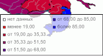

# IMapLegend.BeginUpdate

IMapLegend.BeginUpdate
-

# IMapLegend.BeginUpdate

## Синтаксис

BeginUpdate;

## Описание

Метод BeginUpdate прекращает
 отрисовку легенды.

## Комментарии

Возобновить отрисовку можно, вызвав метод [IMapTerritoryInfo.EndUpdate](../IMapTerritoryInfo/IMapTerritoryInfo.EndUpdate.htm).

## Пример

Для выполнения примера в репозитории предполагается наличие регламентного
 отчёта с идентификатором REPORT. В регламентный отчёт должна быть добавлена
 карта, содержащая только картографический показатель.

Добавьте ссылки на системные сборки: Map, Metabase Report,Tab.

	Sub UserProc;

	Var

	    MB: IMetabase;

	    Report: IPrxReport;

	    Sheet: IPrxSheet;

	    Table: IPrxTable;

	    Objects: ITabObjects;

	    Map: IMap;

	    Layer: IMapLayer;

	    Legend: IMapLegend;

	Begin

	    // Получим репозиторий

	    MB := MetabaseClass.Active;

	    // Получим регламентный отчёт

	    Report := MB.ItemById("REPORT").Edit As IPrxReport;

	    // Получим карту из регламентного отчета

	    Sheet := Report.Activesheet;

	    Table := Sheet As IPrxTable;

	    Objects := Table.TabSheet.Objects;

	    Map := Objects.Item(0).Extension As IMap;

	    // Добавим легенду карты

	    Legend := New DxMapLegend.Create As IMapLegend;

	    Map.View.Legend := Legend;

	    Legend.Visible := True;

	    // Прекратим отрисовку карты

	    Legend.BeginUpdate;

	    // Отобразим в легенде элемент «Нет данных» первым

	    Layer := Map.Layers.FindByName("Regions");

	    Legend.Visual := Layer.Visuals.Item(0);

	    Legend.NoDataElementFirst := True;

	    Legend.NoDataElementVisible := True;

	    // Возобновим отрисовку карты

	    Legend.EndUpdate;

	    //Сохраним изменения

	    (Report As IMetabaseObject).Save;

	End Sub UserProc;

После выполнения примера для картографического показателя будет отображена
 легенда, содержащая элемент «Нет данных» первым:

Отрисовка легенды будет остановлена на время изменения ее параметров.

См. также:

[IMapLegend](IMapLegend.htm)

		Справочная
		 система на версию 10.9
		 от 18/08/2025,
		 © ООО «ФОРСАЙТ»,
