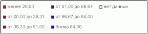

# IMapLegend.ColumnCount

IMapLegend.ColumnCount
-

# IMapLegend.ColumnCount

## Синтаксис

ColumnCount: Integer;

## Описание

Свойство ColumnCount определяет
 количество столбцов в легенде.

## Комментарии

Если значение данного свойства равно нулю, то количество столбцов устанавливается
 автоматически.

## Пример

Для выполнения примера предполагается наличие на форме компонентов Button,
 MapBox, UiMap с наименованиями Button1, MapBox1 и UiMap1 соответственно.
 UiMap1 является источником данных для MapBox1. К компоненту UiMap1 должна
 быть подключена карта, содержащая только картографический показатель.

Пример является обработчиком события OnClick для компонента Button1.

Добавьте ссылки на системные сборки: ExtCtrls, Forms, Map.

	Sub Button1OnClick(Sender: Object; Args: IMouseEventArgs);

	Var

	    Map: IMap;

	    Layer: IMapLayer;

	    Legend: IMapLegend;

	Begin

	    Map := UiMap1.Map;

	    Legend := New DxMapLegend.Create As IMapLegend;

	    Map.View.Legend := Legend;

	    Legend.Visible := True;

	    Legend.BeginUpdate;

	    Layer := Map.Layers.FindByName("Regions");

	    Legend.Visual := Layer.Visuals.Item(0);

	    Legend.ColumnCount := 3;

	    Legend.EndUpdate;

	End Sub Button1OnClick;

После выполнения примера для картографического показателя будет отображена
 легенда, содержащая не более трех столбцов:

См. также:

[IMapLegend](IMapLegend.htm)

		Справочная
		 система на версию 10.9
		 от 18/08/2025,
		 © ООО «ФОРСАЙТ»,
