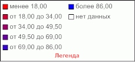

# IMapLegend.Footer

IMapLegend.Footer
-

# IMapLegend.Footer

## Синтаксис

Footer: [IMapLegendHeader](../IMapLegendHeader/IMapLegendHeader.htm);

## Описание

Свойство Footer возвращает параметры
 нижнего текста легенды.

## Пример

Для выполнения примера предполагается наличие на форме компонентов Button,
 MapBox, UiMap с наименованиями Button1, MapBox1 и UiMap1 соответственно.
 UiMap1 является источником данных для MapBox1. К компоненту UiMap1 должна
 быть подключена карта, содержащая только картографический показатель.

Пример является обработчиком события OnClick для компонента Button1.

Добавьте ссылки на системные сборки:
 Drawing, ExtCtrls, Forms, Map.

	Sub Button1OnClick(Sender: Object; Args: IMouseEventArgs);

	Var

	    Map: IMap;

	    Layer: IMapLayer;

	    Legend: IMapLegend;

	    Footer: IMapLegendHeader;

	    Font: IGxFont;

	Begin

	    Map := UiMap1.Map;

	    Legend := New DxMapLegend.Create As IMapLegend;

	    Map.View.Legend := Legend;

	    Legend.Visible := True;

	    // Прекратим отрисовку легенды

	    Legend.BeginUpdate;

	    Layer := Map.Layers.FindByName("Regions");

	    Legend.Visual := Layer.Visuals.Item(0);

	    // Зададим параметры нижнего текста легенды

	    Footer := Legend.Footer;

	    // Зададим цвет шрифта колонтитула легенды

	    Footer.Color := GxColor.FromName("Red");

	    Font := New GxFont.Create("Arial", 15, GxFontStyle.Bold);

	    // Зададим шрифт колонтитула легенды

	    Footer.Font := Font;

	    // Зададим текст колонтитула легенды

	    Footer.Text := "Легенда";

	    // Возобновим отрисовку легенды

	    Legend.EndUpdate;

	End Sub Button1OnClick;

После выполнения примера для картографического показателя будет отображена
 легенда. Нижний текст легенды будет содержать слово «Легенда»:

См. также:

[IMapLegend](IMapLegend.htm)

		Справочная
		 система на версию 10.9
		 от 18/08/2025,
		 © ООО «ФОРСАЙТ»,
