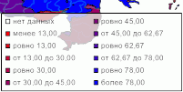

# IMapLegend.IncludeEquals

IMapLegend.IncludeEquals
-

# IMapLegend.IncludeEquals

## Синтаксис

IncludeEquals: Boolean;

## Описание

Свойство IncludeEquals определяет,
 отображать ли элемент «Равно».

## Комментарии

Допустимые значения:

	- True. Отображать элемент
	 «Равно»;

	- False. Не отображать
	 элемент «Равно».

## Пример

Для выполнения примера предполагается наличие на форме компонентов Button,
 MapBox, UiMap с наименованиями Button1, MapBox1 и UiMap1 соответственно.
 UiMap1 является источником данных для MapBox1. К компоненту UiMap1 должна
 быть подключена карта, содержащая только картографический показатель.

Пример является обработчиком события OnClick для компонента Button1.

Добавьте ссылки на системные сборки: ExtCtrls, Forms, Map.

	Sub Button1OnClick(Sender: Object; Args: IMouseEventArgs);

	Var

	    Map: IMap;

	    Layer: IMapLayer;

	    Legend: IMapLegend;

	Begin

	    Map := UiMap1.Map;

	    Legend := New DxMapLegend.Create As IMapLegend;

	    Map.View.Legend := Legend;

	    Legend.Visible := True;

	    Legend.BeginUpdate;

	    Layer := Map.Layers.FindByName("Regions");

	    // Зададим показатель, по которому отображается легенда

	    Legend.Visual := Layer.Visuals.Item(0);

	    // Установим признак отображения элемента «Нет данных»

	    Legend.NoDataElementVisible := True;

	    // Установим признак отображения элемента «Нет данных» первым

	    Legend.NoDataElementFirst := True;

	    // Установим признак отображения элемента «Равно»

	    Legend.IncludeEquals:=True;

	    Legend.EndUpdate;

	End Sub Button1OnClick;

После выполнения примера для картографического показателя будет отображена
 легенда, отображающая элементы «Нет данных» и «Равно»:

См. также:

[IMapLegend](IMapLegend.htm)

		Справочная
		 система на версию 10.9
		 от 18/08/2025,
		 © ООО «ФОРСАЙТ»,
