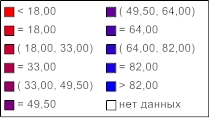

# IMapLegend.LabelFormat

IMapLegend.LabelFormat
-

# IMapLegend.LabelFormat

## Синтаксис

LabelFormat: [IMapLegendLabelFormat](../IMapLegendLabelFormat/IMapLegendLabelFormat.htm);

## Описание

Свойство LabelFormat возвращает
 параметры формата подписей легенды.

## Пример

Для выполнения примера предполагается наличие на форме компонентов Button,
 MapBox, UiMap с наименованиями Button1, MapBox1 и UiMap1 соответственно.
 UiMap1 является источником данных для MapBox1. К компоненту UiMap1 должна
 быть подключена карта, содержащая только картографический показатель.

Пример является обработчиком события OnClick для компонента Button1.

Добавьте ссылки на системные сборки: Drawing, ExtCtrls, Forms, Map.

	Sub Button1OnClick(Sender: Object; Args: IMouseEventArgs);

	Var

	    Map: IMap;

	    Layer: IMapLayer;

	    Legend: IMapLegend;

	    Label: IMapLegendLabelFormat;

	Begin

	    Map := UiMap1.Map;

	    Legend := New DxMapLegend.Create As IMapLegend;

	    Map.View.Legend := Legend;

	    Legend.Visible := True;

	    // Прекратим отрисовку легенды

	    Legend.BeginUpdate;

	    // Найдём слой по наименованию

	    Layer := Map.Layers.FindByName("Regions");

	    // Определим показатель, по которому отображается легенда

	    Legend.Visual := Layer.Visuals.Item(0);

	    // Зададим признак отображения элемента «Равно»

	    Legend.IncludeEquals:=True;

	    // Зададим формат подписей

	    Label := Legend.LabelFormat;

	    // Зададим формат строки для подписи «Меньше»

	    Label.Less := "< %value";

	    // Зададим формат строки для подписи «Равно»

	    Label.Equal := "= %value";

	    // Зададим формат строки для подписи «Между»

	    Label.Between := "( %min, %max)";

	    // Зададим формат строки для подписи «Больше»

	    Label.Greater := "> %value";

	    // Зададим формат строки для подписи «Пусто»

	    Label.NoData := "нет данных";

	    // Возобновим отрисовку легенды

	    Legend.EndUpdate;

	End Sub Button1OnClick;

После выполнения примера для картографического показателя будет отображена
 легенда. Формат подписей легенды будет изменен:

См. также:

[IMapLegend](IMapLegend.htm)

		Справочная
		 система на версию 10.9
		 от 18/08/2025,
		 © ООО «ФОРСАЙТ»,
