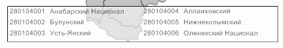

# IMapTerritoryInfo.BeginUpdate

IMapTerritoryInfo.BeginUpdate
-

# IMapTerritoryInfo.BeginUpdate

## Синтаксис

BeginUpdate;

## Описание

Выполнение метода BeginUpdate
 позволяет прекратить отрисовку расшифровки территорий.

## Комментарии

Все изменения, произведенные с расшифровкой территорий, не будут отображаться
 до тех пор, пока не будет вызван метод [IMapTerritoryInfo.EndUpdate](IMapTerritoryInfo.EndUpdate.htm).

## Пример

Для выполнения примера предполагается наличие на форме компонентов Button,
 MapBox, UiMap с наименованиями Button1, MapBox1 и UiMap1 соответственно.
 UiMap1 является источником данных для MapBox1. К компоненту UiMap1 должна
 быть подключена карта.

Пример является обработчиком события OnClick для компонента Button1.

Добавьте ссылки на системные сборки:
 ExtCtrls, Forms, Map.

	Sub Button1OnClick(Sender: Object; Args: IMouseEventArgs);

	Var

	    Map: IMap;

	    TerrI: IMapTerritoryInfo;

	Begin

	    // Определим карту

	    Map := UiMap1.Map;

	    TerrI := New DxMapTerritoryInfo.Create;

	    // Зададим расшифровку территории

	    Map.View.TerritoryInfo := TerrI;

	    // Определим слой, по которому отображается расшифровка

	    TerrI.Layer := Map.Layers.FindByName("Regions");

	    // Прекратим отрисовку территорий

	    TerrI.BeginUpdate;

	    // Включим отображение расшифровки территорий

	    TerrI.Visible:= True;

	    // Зададим максимальное количество столбцов в расшифровке

	    TerrI.ColumnCount := 2;

	    // Зададим параметры сортировки элементов в расшифровке

	    TerrI.SortType := MapTerritoryInfoSortType.Code;

	    // Включим отображение в расшифровке только видимых на карте территорий

	    TerrI.DisplayVisibleOnly := True;

	    // Возобновим отрисовку территорий

	    TerrI.EndUpdate;

	End Sub Button1OnClick;

После выполнения примера отрисовка расшифровки территорий будет прекращена,
 элементы будут отсортированы по идентификатору и размещены в соответствие
 с заданным максимальным количеством столбцов в расшифровке. В расшифровке
 будут отображаться только видимые на карте территории:

Затем отрисовка будет возобновлена.

См. также:

[IMapTerritoryInfo](IMapTerritoryInfo.htm)

		Справочная
		 система на версию 10.9
		 от 18/08/2025,
		 © ООО «ФОРСАЙТ»,
