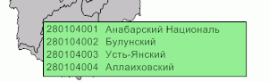

# IMapTerritoryInfo.Color

IMapTerritoryInfo.Color
-

# IMapTerritoryInfo.Color

## Синтаксис

Color: [IGxColor](ModDrawing.chm::/Interface/IGxColor/IGxColor.htm);

## Описание

Свойство Color определяет цвет
 фона расшифровки территорий.

## Пример

Для выполнения примера предполагается наличие на форме компонентов Button,
 MapBox, UiMap с наименованиями Button1, MapBox1 и UiMap1 соответственно.
 UiMap1 является источником данных для MapBox1. К компоненту UiMap1 должна
 быть подключена карта.

Пример является обработчиком события OnClick для компонента Button1.

Добавьте ссылки на системные сборки:
 Drawing, ExtCtrls, Forms, Map.

	Sub Button1OnClick(Sender: Object; Args: IMouseEventArgs);

	Var

	    Map: IMap;

	    TerrI: IMapTerritoryInfo;

	    C: IGxColor;

	Begin

	    Map := UiMap1.Map;

	    TerrI := New DxMapTerritoryInfo.Create;

	    Map.View.TerritoryInfo := TerrI;

	    TerrI.Layer := Map.Layers.FindByName("Regions");

	    C := GxColor.FromName("LightGreen");

	    TerrI.Color := C;

	End Sub Button1OnClick;

После выполнения примера цвет фона расшифровки территорий будет изменен
 на светло-зеленый:

См. также:

[IMapTerritoryInfo](IMapTerritoryInfo.htm)

		Справочная
		 система на версию 10.9
		 от 18/08/2025,
		 © ООО «ФОРСАЙТ»,
