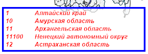

# IMapTerritoryInfo.Font

IMapTerritoryInfo.Font
-

# IMapTerritoryInfo.Font

## Синтаксис

Font: [IGxFont](ModDrawing.chm::/Interface/IGxFont/IGxFont.htm);

## Описание

Свойство Font определяет параметры
 шрифта расшифровки.

## Пример

Для выполнения примера предполагается наличие на форме компонентов Button,
 MapBox, UiMap с наименованиями Button1, MapBox1 и UiMap1 соответственно.
 UiMap1 является источником данных для MapBox1. К компоненту UiMap1 должна
 быть подключена карта.

Пример является обработчиком события OnClick для компонента Button1.

Добавьте ссылки на системные сборки:
 Drawing, ExtCtrls, Forms, Map.

	Sub Button1OnClick(Sender: Object; Args: IMouseEventArgs);

	Var

	    Map: IMap;

	    TerrI: IMapTerritoryInfo;

	    Font: IGxFont;

	    Color: IGxColor;

	    Pen: IGxPen;

	Begin

	    // Определим карту

	    Map := UiMap1.Map;

	    TerrI := New DxMapTerritoryInfo.Create;

	    Map.View.TerritoryInfo := TerrI;

	    // Определим слой, по которому отображается расшифровка

	    TerrI.Layer := Map.Layers.FindByName("Regions");

	    // Зададим максимальное количество элементов в расшифровке

	    TerrI.MaxItemCount := 5;

	    // Зададим расстояние между идентификатором и наименованием элемента расшифровки

	    TerrI.MarkerCellPadding := 5;

	    // Зададим параметры границы расшифровки территорий

	    Color := GxColor.FromName("Blue");

	    Pen := New GxPen.CreateSolid(Color);

	    TerrI.BorderPen := Pen;

	    // Зададим шрифт расшифровки

	    Font := New GxFont.Create("Arial", 10, 3 As GxFontStyle);

	    // F := New GxFont.Create("Courier New", 10, 2 As GxFontStyle);

	    TerrI.Font := Font;

	    // Зададим цвет шрифта расшифровки

	    Color := GxColor.FromName("Red");

	    TerrI.FontColor := Color;

	    // Узнаем, изменилась ли расшифрока территорий

	    If TerrI.IsDirty Then

	        Debug.WriteLine("Есть изменения в расшифровке территорий");

	    Else

	        Debug.WriteLine("Нет изменения в расшифровке территорий");

	    End If;

	End Sub Button1OnClick;

После выполнения примера к расшифровке будут применены настройки:

	- в расшифровке будет отображаться не более пяти элементов;

	- расстояние между идентификатором и наименованием элемента расшифровки
	 равно пяти;

	- цвет границы расшифровки территорий будет изменён на синий;

	- шрифт расшифровки будет изменен на Arial десятого размера с
	 начертанием - полужирный курсив;

	- цвет шрифта расшифровки территорий будет изменен на красный.

См. также:

[IMapTerritoryInfo](IMapTerritoryInfo.htm)

		Справочная
		 система на версию 10.9
		 от 18/08/2025,
		 © ООО «ФОРСАЙТ»,
