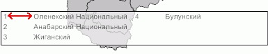

# IMapTerritoryInfo.MarkerCellPadding

IMapTerritoryInfo.MarkerCellPadding
-

# IMapTerritoryInfo.MarkerCellPadding

## Синтаксис

MarkerCellPadding: Double;

## Описание

Свойство MarkerCellPadding определяет
 расстояние между идентификатором и наименованием элемента расшифровки:

## Пример

Использование свойства приведено в примере для свойства [IMapTerritoryInfo.Font](IMapTerritoryInfo.Font.htm).

См. также:

[IMapTerritoryInfo](IMapTerritoryInfo.htm)

		Справочная
		 система на версию 10.9
		 от 18/08/2025,
		 © ООО «ФОРСАЙТ»,
