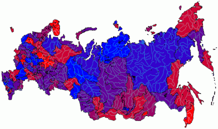

# IMapVisualColorProperty.DataAdapter

IMapVisualColorProperty.DataAdapter
-

# IMapVisualColorProperty.DataAdapter

## Синтаксис

DataAdapter: Object;

## Описание

Свойство DataAdapter определяет
 источник данных, в соответствии с которым будет производиться заливка.

## Пример

Для выполнения примера предполагается наличие на форме компонентов Button,
 MapBox, UiMap с наименованиями Button1, MapBox1 и UiMap1 соответственно.
 UiMap1 является источником данных для MapBox1. К компоненту UiMap1 должна
 быть подключена карта. Также должен быть реализован класс VisualDataAdapter,
 создающий динамический источник данных. Пример данного класса содержится
 в описании свойства [IMapVisual.DataAdapter](../IMapVisual/IMapVisual.DataAdapter.htm).

Пример является обработчиком события OnClick для компонента Button1.

Добавьте ссылки на системные сборки:
 Drawing, ExtCtrls, Forms, Map.

	Sub Button1OnClick(Sender: Object; Args: IMouseEventArgs);

	Var

	    Map: IMap;

	    Layer: IMapLayer;

	    AreaVisual: IMapAreaVisual;

	    Color: IMapVisualColorProperty;

	    StartC, EndC: IGxColor;

	    Scale: IMapColorScale;

	Begin

	    Map := UiMap1.Map;

	    Layer := Map.Layers.FindByName("Regions");

	    AreaVisual := Layer.Visuals.AddAreaVisual;

	    AreaVisual.DataAdapter := New VisualDataAdapter.Create As IMapDynamicDataAdapter;

	    Color := AreaVisual.Color;

	    Color.Dependent := True;

	    Color.DataAdapter := AreaVisual.DataAdapter;

	    Scale := New DxMapColorScale.Create As IMapColorScale;

	    StartC := GxColor.FromName("Red");

	    EndC := GxColor.FromName("Blue");

	    Scale.AutoSetup(Layer, AreaVisual.DataAdapter, StartC, EndC);

	    Color.Scale := Scale;

	End Sub Button1OnClick;

После выполнения примера на слой «Regions» будет добавлен картографический
 показатель, заливка которого будет определяться цветовой шкалой. Источник
 данных, в соответствии с которым будет производиться заливка, совпадает
 с источником данных показателя:

См. также:

[IMapVisualColorProperty](IMapVisualColorProperty.htm)

		Справочная
		 система на версию 10.9
		 от 18/08/2025,
		 © ООО «ФОРСАЙТ»,
