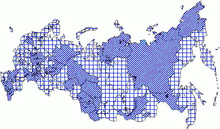

# IMapVisualFillProperty.DataAdapter

IMapVisualFillProperty.DataAdapter
-

# IMapVisualFillProperty.DataAdapter

## Синтаксис

DataAdapter: Object;

## Описание

Свойство DataAdapter определяет
 источник данных, в соответствии с которым будет производиться штриховка.

## Пример

Для выполнения примера предполагается наличие на форме компонентов Button,
 MapBox, UiMap с наименованиями Button1, MapBox1 и UiMap1 соответственно.
 UiMap1 является источником данных для MapBox1. К компоненту UiMap1 должна
 быть подключена карта. Также должен быть реализован класс VisualDataAdapter,
 создающий динамический источник данных. Пример данного класса содержится
 в описании свойства [IMapVisual.DataAdapter](../IMapVisual/IMapVisual.DataAdapter.htm).

Пример является обработчиком события OnClick для компонента Button1.

Добавьте ссылки на системные сборки:
 Drawing, ExtCtrls, Forms, Map.

	Sub Button1OnClick(Sender: Object; Args: IMouseEventArgs);

	Var

	    Map: IMap;

	    Layer: IMapLayer;

	    AreaVisual: IMapAreaVisual;

	    Fill: IMapVisualFillProperty;

	    Color: IMapVisualColorProperty;

	    Scale: IMapFillScale;

	Begin

	    Map := UiMap1.Map;

	    Layer := Map.Layers.FindByName("Regions");

	    AreaVisual := Layer.Visuals.AddAreaVisual;

	    AreaVisual.DataAdapter := New VisualDataAdapter.Create As IMapDynamicDataAdapter;

	    Fill := AreaVisual.Fill;

	    Fill.DataAdapter := AreaVisual.DataAdapter;

	    Scale := Fill.Scale;

	    Scale.Count := 1;

	    Scale.AutoCalculable := True;

	    Scale.Fill(0, MapScaleSettingImpact.Greater) := GxHatchStyle.Cross;

	    Scale.Fill(0, MapScaleSettingImpact.Less) := GxHatchStyle.DarkUpwardDiagonal;

	    Fill.Dependent := True;

	    Color := AreaVisual.FillColor;

	    Color.Values.Count := 1;

	    Color.Values.Item(0) := GxColor.FromName("Blue");

	    Map.Refresh;

	End Sub Button1OnClick;

После выполнения примера на слой «Regions» будет добавлен картографический
 показатель, штриховка которого имеет синий цвет и будет определяться шкалой.
 Источник данных, в соответствии с которым будет производиться штриховка,
 совпадает с источником данных показателя:

См. также:

[IMapVisualFillProperty](IMapVisualFillProperty.htm)

		Справочная
		 система на версию 10.9
		 от 18/08/2025,
		 © ООО «ФОРСАЙТ»,
