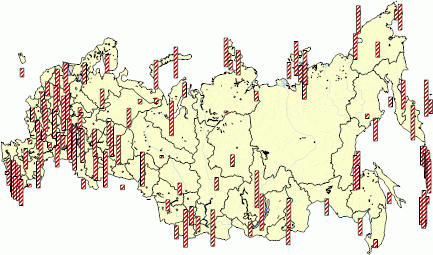

# IMapVisualFillProperty.Value

IMapVisualFillProperty.Value
-

# IMapVisualFillProperty.Value

## Синтаксис

Value: [GxHatchStyle](ModDrawing.chm::/Enums/GxHatchStyle.htm);

## Описание

Свойство Value определяет тип
 штриховки показателя.

## Пример

Для выполнения примера предполагается наличие на форме компонентов Button,
 MapBox, UiMap с наименованиями Button1, MapBox1 и UiMap1 соответственно.
 UiMap1 является источником данных для MapBox1. К компоненту UiMap1 должна
 быть подключена карта. Также должен быть реализован класс VisualDataAdapter,
 создающий динамический источник данных. Пример данного класса содержится
 в описании свойства [IMapVisual.DataAdapter](../IMapVisual/IMapVisual.DataAdapter.htm).

Пример является обработчиком события OnClick для компонента Button1.

Добавьте ссылки на системные сборки:
 Drawing, ExtCtrls, Forms, Map.

	Sub Button1OnClick(Sender: Object; Args: IMouseEventArgs);

	Var

	    Map: IMap;

	    Layer: IMapLayer;

	    BarVisual: IMapBarVisual;

	    Fill: IMapVisualFillProperty;

	    Color: IMapVisualColorProperty;

	    Collection: IMapColorCollection;

	Begin

	    Map := UiMap1.Map;

	    Layer := Map.Layers.FindByName("Regions");

	    BarVisual := Layer.Visuals.AddBarVisual;

	    BarVisual.DataAdapter := New VisualDataAdapter.Create As IMapDynamicDataAdapter;

	    Fill := BarVisual.Fill;

	    Fill.Dependent := False;

	    Fill.Value := GxHatchStyle.DarkUpwardDiagonal;

	    Color := BarVisual.FillColor;

	    Collection := Color.Values;

	    Collection.Item(0) := GxColor.FromName("Red");

	    BarVisual.Width.Value := 1;

	End Sub Button1OnClick;

После выполнения примера на слой «Regions» будет добавлен столбиковый
 показатель, штриховка которого имеет красный цвет:

См. также:

[IMapVisualFillProperty](IMapVisualFillProperty.htm)

		Справочная
		 система на версию 10.9
		 от 18/08/2025,
		 © ООО «ФОРСАЙТ»,
