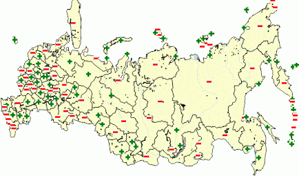

# IMapVisualIconProperty.Scale

IMapVisualIconProperty.Scale
-

# IMapVisualIconProperty.Scale

## Синтаксис

Scale: [IMapIconScale](../IMapIconScale/IMapIconScale.htm);

## Описание

Свойство Scale определяет шкалу
 для показателя.

## Пример

Для выполнения примера предполагается наличие на форме компонентов Button,
 MapBox, UiMap с наименованиями Button1, MapBox1 и UiMap1 соответственно.
 UiMap1 является источником данных для MapBox1. К компоненту UiMap1 должна
 быть подключена карта. Также должен быть реализован класс VisualDataAdapter,
 создающий динамический источник данных. Пример данного класса содержится
 в описании свойства [IMapVisual.DataAdapter](../IMapVisual/IMapVisual.DataAdapter.htm). В
 файловой системе должны присутствовать файлы «C:\bad.gif» и «C:\good.gif»,
 содержащие изображение.

Пример является обработчиком события OnClick для компонента Button1.

Добавьте ссылки на системные сборки:
 Drawing, ExtCtrls, Forms, Map.

	Sub Button1OnClick(Sender: Object; Args: IMouseEventArgs);

	Var

	    Map: IMap;

	    Layer: IMapLayer;

	    ImageVisual: IMapImageVisual;

	    ImageProp: IMapVisualIconProperty;

	    Scale: IMapIconScale;

	Begin

	    Map := UiMap1.Map;

	    Layer := Map.Layers.FindByName("Regions");

	    ImageVisual := Layer.Visuals.AddImageVisual;

	    ImageVisual.DataAdapter := New VisualDataAdapter.Create As IMapDynamicDataAdapter;

	    ImageProp := ImageVisual.Image;

	    ImageProp.DataAdapter := ImageVisual.DataAdapter;

	    ImageVisual.Height.Value := 3;

	    ImageVisual.Width.Value := 3;

	    ImageProp.Dependent := True;

	    Scale := ImageProp.Scale;

	    Scale.Count := 1;

	    Scale.Value(0) := 50;

	    Scale.Greater(0) := GxImage.FromFile("C:\bad.gif");

	    Scale.Less(0) := GxImage.FromFile("C:\good.gif");

	End Sub Button1OnClick;

После выполнения примера на слой «Regions» будет добавлен пиктографический
 показатель, длина и ширина которого будет 4 пикселя. Пиктограмма показателя
 будет определяться шкалой:

См. также:

[IMapVisualIconProperty](IMapVisualIconProperty.htm)

		Справочная
		 система на версию 10.9
		 от 18/08/2025,
		 © ООО «ФОРСАЙТ»,
