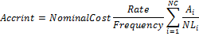

# IFinance.Accrint

IFinance.Accrint
-

# IFinance.Accrint

## Синтаксис

Accrint(Issue: DateTime; FirstInterest:
DateTime; Settlement: DateTime; Rate: Double; NominalCost: Double;
Frequency: Integer; [Basis: Integer=0]): Double;

## Параметры

Issue. Дата выпуска ценных
 бумаг. Должен быть меньше Settlement;

FirstInterest. Дата первой
 выплаты по ценным бумагам;

Settlement. Дата расчета за
 ценные бумаги. Должен быть больше Issue;

Rate. Годовая процентная ставка
 для купонов по ценным бумагам. Должен быть положительным;

NominalCost. Номинальная стоимость
 ценных бумаг. Должен быть положительным;

Frequency. Количество купонных
 выплат в год. Параметр может принимать следующие значения:

	- 1. Ежегодные выплаты;

	- 2. Полугодовые выплаты;

	- 4. Ежеквартальные выплаты;

Basis. Используемый способ
 вычисления дня. Задается в интервале от 0 до 4:

	- 0. Способ вычисления
	 дня американский/360 дней (метод NSAD). Значение по умолчанию;

	- 1. Способ вычисления
	 дня Фактический/фактический;

	- 2. Способ вычисления
	 дня Фактический/360 дней;

	- 3. Способ вычисления
	 дня Фактический/365 дней;

	- 4. Способ вычисления
	 дня европейский 30/360 дней.

Необязательный параметр.

## Описание

Метод Accrint возвращает накопленный
 процент по ценным бумагам с периодической выплатой процентов.

## Комментарии

Accrint вычисляется следующим
 образом:

,

где:

	- NC. Число квазикупонных
	 периодов, которые укладываются в оставшийся период. Если это число
	 содержит дробную часть, то оно округляется с избытком до следующего
	 целого;

	- Ai. Число накопленных
	 дней для i-го квазикупонного периода в оставшемся периоде выплат;

	- NLi. Нормальная продолжительность
	 в днях i-го квазикупонного периода в оставшемся периоде.

## Пример

Добавьте ссылку на системную сборку MathFin.

					Sub UserProc;

		Var

		    r: Double;

		Begin

		    r := Finance.Accrint(DateTime.ComposeDay(2008,01,11),

		        DateTime.ComposeDay(2008,02,11), DateTime.ComposeDay(2008,03,11), 0.1, 1000, 2, 0);

		    Debug.WriteLine(r);

		End Sub UserProc;

В результате выполнения примера в окно консоли будет выведен накопленный
 процент, равный 16.67.

См. также:

[IFinance](IFinance.htm)

		Справочная
		 система на версию 10.9
		 от 18/08/2025,
		 © ООО «ФОРСАЙТ»,
